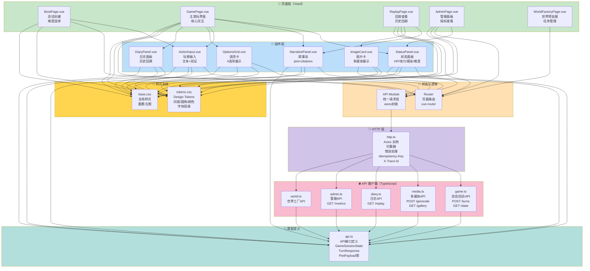

# 末日生存文字游戏平台 — 完整架构模块关系图

## 目录
1. [总体架构分层](#总体架构分层)
2. [后端模块关系](#后端模块关系)
3. [前端模块关系](#前端模块关系)
4. [前后端交互](#前后端交互)
5. [数据流向](#数据流向)
6. [模块分类与依赖](#模块分类与依赖)
7. [风险自查与扩展性](#风险自查与扩展性)

---

## 总体架构分层

```
┌─────────────────────────────────────────────────────────────────┐
│                       客户端层（Vue3）                          │
│  [启动页] [游玩页] [回放页] [管理页]  ←→  API 请求/响应        │
└─────────────────────────────────────────────────────────────────┘
                               ↓
┌─────────────────────────────────────────────────────────────────┐
│                  Spring Boot 3 REST API 层                       │
│  GameSessionController / MediaImageController / AdminController │
└─────────────────────────────────────────────────────────────────┘
                               ↓
┌─────────────────────────────────────────────────────────────────┐
│                   编排与业务逻辑层                              │
│  TurnOrchestrator → AgentChain → 责任链（8个Agent）            │
└─────────────────────────────────────────────────────────────────┘
                               ↓
┌─────────────────────────────────────────────────────────────────┐
│                   多层辅助业务层                                │
│  ┌─────────────┬────────────┬──────────┬──────────┬────────┐   │
│  │ 检索层      │ 冲突仲裁   │ 日志系统 │ 工具执行 │ 多媒体 │   │
│  │ (Retrieval) │(Arbitration)│(Diary)  │(Tools)   │(Media) │   │
│  └─────────────┴────────────┴──────────┴──────────┴────────┘   │
└─────────────────────────────────────────────────────────────────┘
                               ↓
┌─────────────────────────────────────────────────────────────────┐
│                   数据与存储层                                  │
│  Redis (会话状态/分层记忆)  ← →  PostgreSQL (持久化/向量索引)  │
└─────────────────────────────────────────────────────────────────┘
                               ↓
┌─────────────────────────────────────────────────────────────────┐
│                   外部服务与基础设施                            │
│  DashScope(文本/嵌入) / 文生图(DALL-E/本地模型) / 图片库         │
└─────────────────────────────────────────────────────────────────┘
```

---

## 后端模块关系

```mermaid
graph TB
    subgraph API["📡 API 层（HTTP 入口）"]
        A1["GameSessionController<br/>会话生命周期<br/>POST /sessions<br/>GET /state<br/>POST /turns"]
        A2["MediaImageController<br/>多媒体管理<br/>POST /generate<br/>GET /gallery-search"]
        A3["AdminMetricsController<br/>可观测系统<br/>GET /metrics/*"]
        A4["ArbitrationController<br/>冲突仲裁<br/>POST /arbitrate"]
    end

    subgraph Core["⚙️ 核心编排层（责任链）"]
        O["TurnOrchestrator<br/>单回合驱动引擎<br/>version控制"]
        AC["AgentChain<br/>责任链容器<br/>前置→后置"]
        AH["AgentHandler<br/>Agent抽象基类"]
    end

    subgraph Agents["🤖 Agent 责任链（8个）"]
        AG1["① RouterAgent<br/>路由选择"]
        AG2["② RetrievalAgent<br/>召回<br/>RAG检索"]
        AG3["③ DifficultyDirectorAgent<br/>难度控制"]
        AG4["④ PlotGenerationAgent<br/>剧情生成"]
        AG5["⑤ OptionGenerationAgent<br/>选项生成"]
        AG6["⑥ RuleGuardAgent<br/>规则校验"]
        AG7["⑦ StateCommitAgent<br/>状态提交"]
        AG8["⑧ NarrationAgent<br/>叙事补全"]
    end

    subgraph Supporting["🔧 辅助业务层"]
        RT["ReturnedAgent"]
        ARBI["ConflictArbitrator<br/>冲突仲裁<br/>多层投票"]
        DIARY["GameDiaryService<br/>游戏日志<br/>回放追踪"]
        TOOL["ToolExecutor<br/>工具调用<br/>动态执行"]
        METRIC["AgentMetricsStore<br/>性能指标<br/>Token统计"]
    end

    subgraph Domain["📦 域模型与业务"]
        GS["GameSession<br/>会话主体<br/>版本号+状态"]
        TM["TurnMemory<br/>单回合记忆<br/>L0/L1结构"]
        DIFF["Difficulty<br/>难度枚举"]
        GTF["GameTimeFlow<br/>游戏时间<br/>天/回合"]
    end

    subgraph Repository["🗄️ 数据访问层"]
        REPO1["SessionRepository<br/>会话持久化<br/>PostgreSQL"]
        REPO2["EventCardRepository<br/>事件卡库<br/>PG+向量"]
        REPO3["LorebookEntryRepository<br/>世界观库<br/>PG+向量"]
        REDIS["Redis Client<br/>会话状态缓存<br/>L0/L1分层"]
    end

    subgraph Infra["🌐 基础设施层"]
        LLM["DashScope<br/>Chat/Embedding<br/>Spring AI"]
        IMG["MediaImageService<br/>文生图/图库<br/>降级机制"]
        GUARD["FaultInjectionGuard<br/>故障注入"]
        EXCEPTION["GlobalExceptionHandler<br/>统一异常"]
        TRACE["TraceIdSupport<br/>链路追踪"]
    end

    subgraph Config["⚙️ 配置与工具"]
        WFC["WorldFactoryController<br/>离线预处理<br/>Job调度"]
        TOOL_REG["ToolRegistry<br/>工具注册表"]
        RETRY["RetryExecutor<br/>重试策略"]
        EST["LlmTokenEstimator<br/>Token估算"]
    end

    %% API → 核心编排
    A1 --> O
    A2 --> IMG
    A3 --> METRIC
    A4 --> ARBI

    %% 核心编排 → Agent链
    O --> AC --> AH
    AH --> AG1 & AG2 & AG3 & AG4 & AG5 & AG6 & AG7 & AG8

    %% Agent → 辅助业务
    AG2 --> REPO2 & REPO3
    AG6 --> ARBI
    AG7 --> REPO1
    AG4 & AG5 --> LLM
    O --> DIARY
    O --> METRIC
    AG1 --> TOOL

    %% 域模型
    O --> GS & TM & GTF & DIFF
    REPO1 --> GS
    GS --> REDIS

    %% 数据访问 → 存储
    REPO1 & REPO2 & REPO3 --> PostgreSQL[("🐘 PostgreSQL<br/>+ PGvector<br/>会话/卡/库")]
    REDIS --> Redis[("⚡ Redis<br/>JSON<br/>状态缓存")]

    %% 基础设施
    AG4 & AG5 --> LLM
    A2 --> IMG
    A1 --> TRACE
    ARBI --> EXCEPTION
    TOOL_REG --> TOOL
    EST --> AG4
    EST --> AG5

    %% 配置工具
    WFC -.->|离线预处理| REPO2
    WFC -.->|embedding生成| REPO3
    RETRY -->|通用重试| LLM
    GUARD -.->|故障演练| AG4

    style API fill:#e1f5ff
    style Core fill:#fff3e0
    style Agents fill:#f3e5f5
    style Supporting fill:#e8f5e9
    style Domain fill:#fce4ec
    style Repository fill:#f1f8e9
    style Infra fill:#ede7f6
    style Config fill:#f0f4c3
    style PostgreSQL fill:#c8e6c9
    style Redis fill:#ffe0b2
```



---

## 前端模块关系



---

## 前后端交互

```mermaid
sequenceDiagram
    actor User as 玩家
    participant FE as 前端<br/>Vue3
    participant API as REST API<br/>Spring Boot
    participant Core as 编排层<br/>TurnOrchestrator
    participant Agents as Agent链<br/>8个Agent
    participant LLM as DashScope<br/>LLM服务
    participant Store as Redis/PG<br/>存储层

    User->>FE: ① 点击提交输入或选择选项
    FE->>FE: 参数校验 + Idempotency-Key生成
    FE->>API: ② POST /turns {expectedVersion}
    activate API
    
    API->>Core: ③ 解析请求 + 版本检查
    activate Core
    
    Core->>Agents: ④ 触发责任链 (8个Agent)
    activate Agents
    
    Agents->>Store: ④a 读取EventCard/Lorebook
    activate Store
    Store-->>Agents: 检索结果
    deactivate Store
    
    Agents->>LLM: ④b 调用DashScope
    activate LLM
    LLM-->>Agents: 剧情/选项
    deactivate LLM
    
    Agents->>Store: ④c 写入状态version++
    Store-->>Agents: 确认持久化
    deactivate Store
    
    Agents-->>Core: ④ 返回OptionPayload[] + PlotPayload
    deactivate Agents
    
    Core-->>API: ⑤ 返回SubmitTurnResponse
    deactivate Core
    
    API-->>FE: ⑥ ApiResponse<SubmitTurnResponse>
    deactivate API
    
    FE->>FE: ⑦ 状态合并 + UI更新
    FE-->>User: ⑧ 显示新剧情+选项+状态面板

    Note over FE,Store: 冲突处理流程
    FE->>API: GET /state
    API-->>FE: 返回最新version
    FE->>FE: 版本对比：若冲突 → 刷新 → 显示提示
```

---

## 数据流向

### 1. 会话创建流

```
BootPage [选择难度]
    ↓
POST /api/v1/game/sessions
    ↓
GameSessionController.createSession()
    ↓
GameSessionService.initializeSession()
    ↓
[1] Redis: 存储GameSession (version=0, hp=100, ...)
[2] PostgreSQL: 插入session_history记录
    ↓
前端获得 sessionId
```

### 2. 单回合数据流

```
玩家输入 (文本 + expectedVersion)
    ↓
POST /api/v1/game/sessions/{sessionId}/turns
    ↓
GameSessionController.submitTurn()
    ├─ 校验expectedVersion (乐观锁)
    └─ TurnOrchestrator.executeTurn()
        ↓
    ┌─────────────────────────────────────────┐
    │ Agent 责任链（顺序执行或并行段）         │
    ├─────────────────────────────────────────┤
    │ ① RouterAgent                           │
    │    - 路由选择 (冒险/探索/社交/防守)     │
    │                                         │
    │ ② RetrievalAgent                        │
    │    - 多路召回 EventCard + LorebookEntry│
    │    - 向量相似度 + 标签过滤              │
    │    - 结果合并                           │
    │                                         │
    │ ③ DifficultyDirectorAgent              │
    │    - 难度指数动态调整                   │
    │    - 概率触发特殊事件                   │
    │                                         │
    │ ④ PlotGenerationAgent                   │
    │    - DashScope.chat({context})          │
    │    - 生成narrative text + citations     │
    │                                         │
    │ ⑤ OptionGenerationAgent                 │
    │    - 基于plot生成4个选项                │
    │    - 选项向量化（后续检索用）           │
    │                                         │
    │ ⑥ RuleGuardAgent                        │
    │    - 规则校验（生命值/感染度）          │
    │    - 冲突检测 → ConflictArbitrator      │
    │                                         │
    │ ⑦ StateCommitAgent                      │
    │    - 计算stateDelta (hp/stamina/infection)
    │    - Redis: version++, 原子更新        │
    │    - PostgreSQL: 审计日志               │
    │                                         │
    │ ⑧ NarrationAgent                        │
    │    - 文本补全/锚点清洁                  │
    │    - 最终交付前检查                     │
    └─────────────────────────────────────────┘
        ↓
    TurnMemory 记录 (L0: intent/loss/flags)
        ↓
    GameDiary 异步写入 (后台Job)
        ↓
    AgentMetricsStore 统计 (耗时/Token/错误)
        ↓
SubmitTurnResponse {
    plot: PlotPayload,
    options: OptionPayload[4],
    difficultyDelta: { challengeIndex: +0.05 },
    stateDelta: { staminaLoss: 5, infection: +2 },
    traceId: "tr_xxx"
}
    ↓
返回前端，前端:
    - 合并state (expectedVersion → version++)
    - 渲染新plot + options
    - 更新StatusPanel
```

### 3. 状态存储层

```
Redis (热数据 + 版本控制)
├─ game:session:{sessionId}
│  └─ GameSession JSON (version=N)
├─ game:memory:l0:{sessionId}
│  └─ TurnMemory[].intent/staminaLoss/rewardFlags
└─ game:memory:l1:{sessionId}
   └─ 核心事件向量索引

PostgreSQL (冷数据 + 向量库)
├─ sessions (会话主体)
├─ session_history (审计日志)
├─ event_cards (事件卡库) + embedding vector
├─ lorebook_entries (世界观库) + embedding vector
└─ migration/* (schema演变)
```

---

## 模块分类与依赖

### 核心模块（⭐ 直接影响玩法体验）

| 模块 | 归属层 | 核心职责 | 外部依赖 |
|------|-------|---------|---------|
| **TurnOrchestrator** | 编排层 | 单回合生命周期驱动 | Agent链/Repository/Redis |
| **Agent x8** | Agent层 | 多专家协作生成 | DashScope/Repository/Redis |
| **GameSession** | 域模型 | 会话状态机 | Redis/PG |
| **ConflictArbitrator** | 仲裁层 | 冲突解决 | 规则库/投票引擎 |
| **GameSessionController** | API层 | 会话生命周期HTTP入口 | GameSessionService |

**核心依赖关系：**
```
GameSessionController
  → GameSessionService
    → TurnOrchestrator
      → AgentChain [RetrievalAgent→DifficultyDirector→PlotGenerator→...]
        → DashScope + Repository + Redis
```

### 非核心模块（可选/辅助功能）

| 模块 | 归属层 | 职责 | 替代方案 |
|------|-------|------|---------|
| **MediaImageService** | 多媒体 | 文生图+图库降级 | 纯文本模式 / 静态图库 |
| **GameDiaryService** | 日志 | 会话回放记录 | 实时数据库 / 事件流 |
| **ToolExecutor** | 工具 | 动态工具调用 | Agent直接逻辑 |
| **AdminMetricsController** | 可观测 | 性能指标展示 | 日志聚合 / 分布式追踪 |

**非核心依赖关系：**
```
MediaImageService
  ─→ DashScope或本地模型（可降级至图库）

GameDiaryService
  ─→ 异步Job（可配置关闭）

AdminMetricsController
  ─→ AgentMetricsStore（观测用，无核心路径）
```

### 配置模块（⚙️）

| 模块 | 职责 |
|------|------|
| **WorldFactoryController** | 离线预处理编排（异步Job） |
| **FaultInjectionGuard** | 测试环境故障注入 |
| **GlobalExceptionHandler** | 统一异常处理 |
| **TraceIdSupport** | 链路追踪上下文 |

### 第三方依赖模块

| 依赖 | 类型 | 关键版本 | 用途 | 替代方案 |
|------|------|---------|------|---------|
| **Spring Boot 3.3.5** | 框架 | 3.3.5 | Web + IoC + AOP | Quarkus / Micronaut |
| **Spring AI 1.1.2** | AI框架 | 1.1.2 | ChatClient / EmbeddingModel 抽象 | LangChain / Semantic Kernel |
| **Spring AI Alibaba** | AI实现 | 1.1.2.2 | DashScope集成 | OpenAI / Claude API |
| **Spring Data JPA** | ORM | 3.3.x | PostgreSQL映射 | MyBatis / Hibernate |
| **Spring Data Redis** | 缓存 | 3.3.x | Redis连接/操作 | Lettuce / Jedis |
| **PGVector** | 向量库 | 1.1.2 | PostgreSQL向量索引 | Milvus / Pinecone |
| **PostgreSQL** | 数据库 | 14+ | 关系+向量存储 | MySQL / MongoDB |
| **Redis** | 缓存 | 6.0+ | 会话状态/L0/L1 | Memcached / 内存 |
| **Flyway** | 数据库迁移 | 10.x | Schema版本管理 | Liquibase |
| **Vue3** | 前端框架 | 3.5.13 | 组件化UI | React / Svelte |
| **Axios** | HTTP客户端 | 1.8.4 | 请求封装 | Fetch API / 原生 |

---

## 风险自查与扩展性

### 🔴 高风险点

#### 1. **LLM 推理延迟与Token超预算**
- **现象**：PlotGenerationAgent 单次调用 DashScope 可能 2-5s，高峰期超时
- **自查清单**：
  - [ ] DashScope 是否配置 timeout？(建议 10s)
  - [ ] 是否实现了降级机制（如使用缓存/模板文本）？
  - [ ] Token 消耗是否超过当天额度？(需监控 AgentMetricsStore)
- **缓解方案**：
  - 离线预处理模板 + 在线轻量路由
  - 缓存相同prompt的响应
  - 异步流式返回 (WebSocket 或 Server-Sent Events)
  - 备用模型切换（Qwen/GeminiFlash）

#### 2. **状态版本冲突与并发覆盖**
- **现象**：多个客户端或重试导致 expectedVersion 不匹配，状态混乱
- **自查清单**：
  - [ ] 是否所有写操作都验证 expectedVersion？
  - [ ] Redis 原子操作是否用了 Lua 脚本或乐观锁？
  - [ ] 前端冲突重试是否有退避策略？
- **缓解方案**：
  - StateCommitAgent 使用 Redis WATCH + MULTI 或 Lua 脚本
  - 前端收到 409 CONFLICT_VERSION 时，自动 GET /state + 指数退避重试
  - 参考案例：Redis Transactions 或 Redisson 分布式锁

#### 3. **记忆库检索导致的幻觉与冲突**
- **现象**：RetrievalAgent 召回的 EventCard/Lorebook 与当前状态矛盾，Agent 生成非一致的剧情
- **自查清单**：
  - [ ] 召回是否有冲突检测层（RuleGuardAgent）？
  - [ ] 向量索引维度是否足够（PGVector 现在 1024）？
  - [ ] 是否实现了语义对齐多层投票（如 AgentVotingLayer）？
- **缓解方案**：
  - 提升 Embedding 维度（1024 → 1536）
  - 添加显式规则约束（黑名单/冲突检测）
  - 实现 ConflictArbitrator 多层投票（语义层 + 规则层 + Agent投票）

#### 4. **离线预处理与在线数据不同步**
- **现象**：WorldFactory 构建的 EventCard/Lorebook 版本陈旧，在线查询得到过期数据
- **自查清单**：
  - [ ] worldVersion 是否在 GameSession 中记录？
  - [ ] RetrievalAgent 是否过滤了错误版本的卡？
  - [ ] 更新世界观后是否触发全量重新embedding？
- **缓解方案**：
  - 在 GameSession 中冗余 worldVersion，检索时过滤
  - WorldFactory Job 完成后自动更新指标与告警
  - 定期校验卡库与在线状态一致性

#### 5. **图片生成超时与服务链路断裂**
- **现象**：DALL-E 或文生图服务超时，导致整个 turn 失败
- **自查清单**：
  - [ ] 文生图是否与主链路分离（异步）？
  - [ ] 是否实现了快速降级到本地图库？
  - [ ] 前端是否能容忍图片加载延迟？
- **缓解方案**：
  - MediaImageService 在后台异步生成，立即返回占位符
  - 配置 fallback 机制：DashScope → 本地Stable Diffusion → 图库
  - 设置严格的 timeout (2s)，超时立即回退

### 🟡 中等风险点

| 风险 | 影响范围 | 缓解方案 |
|------|---------|---------|
| **Redis 内存溢出** | 会话缓存丢失 → 状态回滚 | 设置 maxmemory-policy + 定期清理过期数据 |
| **PostgreSQL 连接池耗尽** | API 阻塞 → 超时 | 调整 spring.datasource.hikari.maximumPoolSize |
| **Agent 链中某一环失败** | 整条链中止 → 客户端错误 | 实现 Agent Fallback 或跳过机制 |
| **前端版本冲突重试过多** | 死锁或无限重试 | 指数退避 + 最大重试次数限制 |
| **日志表无限增长** | 磁盘空间耗尽 | 实现日志分片 + 归档策略 |

### 🟢 扩展性考虑

#### 横向扩展

**现状：** 单实例 Spring Boot + 集中式 Redis + PostgreSQL

**扩展方案：**
1. **API 层水平扩展**（无状态）
   - 多个 Spring Boot 实例后接 Nginx 负载均衡
   - 依赖：Redis + PostgreSQL 必须支持并发

2. **Redis 高可用**
   - 单实例 → Redis Sentinel / Cluster
   - 保证会话状态不丢失

3. **PostgreSQL 读写分离**
   - RetrievalAgent 读从库（EventCard/Lorebook）
   - StateCommitAgent 写主库（保证强一致性）

4. **异步 Job 队列**
   - WorldFactory + GameDiary 任务卸载到消息队列（Kafka/RabbitMQ）
   - 专用 Worker 处理，不阻塞主链路

#### 纵向深化

**性能优化：**
1. **批量嵌入缓存**
   - 预计算常见输入的 embedding，存入 PGVector
   - 减少 DashScope 调用

2. **多级缓存**
   - L0: 本地内存（热点Agent结果）
   - L1: Redis（跨请求会话缓存）
   - L2: PostgreSQL（冷数据）

3. **流式生成**
   - Agent 逐步生成 plot，通过 WebSocket 实时推送
   - 降低前端感知延迟

#### 功能扩展

| 扩展方向 | 依赖改动 | 复杂度 |
|---------|---------|--------|
| **多人协作** | 需加分布式锁 + 事件广播 | 高 |
| **动态难度段位** | 只需新增 Difficulty 枚举 + Agent 逻辑 | 低 |
| **语音交互** | 需 ASR/TTS 模块 + 前端适配 | 中 |
| **3D 视觉化** | 完全独立的渲染层 | 高 |
| **离线模式** | 需 SQLite + 本地 LLM | 高 |

---

## 总结表

### 关键数据流路径（按优先级）

```
🔴 P0 (核心玩法)：
  玩家输入 → GameSessionController → TurnOrchestrator → Agent链 → Redis/PG → 前端展示

🟡 P1 (关键体验)：
  图片需求 → MediaImageService → DashScope → 图库降级
  回放查询 → GameDiaryService → PostgreSQL → 前端展示
  
🟢 P2 (监控告警)：
  Agent执行 → AgentMetricsStore → 指标上报 → AdminMetricsController
  
🔵 P3 (离线预处理)：
  WorldFactory → Job调度 → embedding生成 → PGVector索引
```

### 模块成熟度评估

| 模块 | 成熟度 | 优化空间 |
|------|--------|---------|
| API层 | ⭐⭐⭐⭐ | HTTP/2推送、GraphQL |
| 编排层 | ⭐⭐⭐⭐ | 并行Agent、超时隔离 |
| Agent链 | ⭐⭐⭐ | 失败回退、动态路由 |
| 仲裁层 | ⭐⭐ | 多层投票完善、学习机制 |
| 存储层 | ⭐⭐⭐⭐ | 读写分离、备份冗余 |
| 前端 | ⭐⭐⭐ | 离线缓存、PWA改造 |

---

## 快速参考：新增功能应该改动哪些模块？

- **新增玩家属性**（如"饥饿度"）→ GameSession + Agent逻辑
- **新增事件类型** → EventCard模型 + WorldFactory
- **新增难度分级** → Difficulty枚举 + DifficultyDirectorAgent
- **新增选项生成策略** → OptionGenerationAgent 逻辑
- **新增图片风格** → MediaImageService prompt 模板
- **新增管理功能** → AdminMetricsController + 新API
- **新增Agent专家** → AgentChain 扩展 + 责任链顺序调整

# 单回合数据流

## 总流程

### 2. 单回合数据流

```
玩家输入 (文本 + expectedVersion)
    ↓
POST /api/v1/game/sessions/{sessionId}/turns
    ↓
GameSessionController.submitTurn()
    ├─ 校验expectedVersion (乐观锁)
    └─ TurnOrchestrator.executeTurn()
        ↓
    ┌─────────────────────────────────────────┐
    │ Agent 责任链（顺序执行或并行段）         │
    ├─────────────────────────────────────────┤
    │ ① RouterAgent                           │
    │    - 路由选择 (冒险/探索/社交/防守)     │
    │                                         │
    │ ② RetrievalAgent                        │
    │    - 多路召回 EventCard + LorebookEntry│
    │    - 向量相似度 + 标签过滤              │
    │    - 结果合并                           │
    │                                         │
    │ ③ DifficultyDirectorAgent              │
    │    - 难度指数动态调整                   │
    │    - 概率触发特殊事件                   │
    │                                         │
    │ ④ PlotGenerationAgent                   │
    │    - DashScope.chat({context})          │
    │    - 生成narrative text + citations     │
    │                                         │
    │ ⑤ OptionGenerationAgent                 │
    │    - 基于plot生成4个选项                │
    │    - 选项向量化（后续检索用）           │
    │                                         │
    │ ⑥ RuleGuardAgent                        │
    │    - 规则校验（生命值/感染度）          │
    │    - 冲突检测 → ConflictArbitrator      │
    │                                         │
    │ ⑦ StateCommitAgent                      │
    │    - 计算stateDelta (hp/stamina/infection)
    │    - Redis: version++, 原子更新        │
    │    - PostgreSQL: 审计日志               │
    │                                         │
    │ ⑧ NarrationAgent                        │
    │    - 文本补全/锚点清洁                  │
    │    - 最终交付前检查                     │
    └─────────────────────────────────────────┘
        ↓
    TurnMemory 记录 (L0: intent/loss/flags)
        ↓
    GameDiary 异步写入 (后台Job)
        ↓
    AgentMetricsStore 统计 (耗时/Token/错误)
        ↓
SubmitTurnResponse {
    plot: PlotPayload,
    options: OptionPayload[4],
    difficultyDelta: { challengeIndex: +0.05 },
    stateDelta: { staminaLoss: 5, infection: +2 },
    traceId: "tr_xxx"
}
    ↓
返回前端，前端:
    - 合并state (expectedVersion → version++)
    - 渲染新plot + options
    - 更新StatusPanel
```

### 3. 状态存储层

```
SQL（少量必须）
  player_state
  game_session
  turn_memory
  ai_ingest_audit

文件 / Markdown（自由、简单、AI友好）
  world.md
  npcs.md
  relations.md
  locations.md
  lore.md
  events.m
```

```
【上层：热数据层】           Redis
   玩家状态 hp / 体力 / 感染
   会话 version 乐观锁
   L0 轻量记忆
   热选项缓存
   ↓ (异步持久化)
【下层：持久化层】          PostgreSQL (SQL)
   player_state
   npc_profile
   memory_event
   npc_relation
   location
   event_card
   lorebook_entry
   world_chunk / entity / rule
   ai_ingest_audit
   GameDiary
【检索层】
   向量库（Redis/专用库
```

读写顺序:

读：先 Redis → 没有 → 再 SQL → 回写 Redis

写：同步写 Redis（保证快）,异步写 SQL（保证不卡玩家）

####  4 个独立线程池 

**1）回合记忆入库池（asyncTurnIngestPool｜最高优先级｜IO密集）**：用于解析回合变更意图，完成记忆、人设、关系持久化以及L0/L1/L2层级记忆聚合，兼顾Redis与SQL双写入；核心线程4~8、最大线程8~16、队列容量100；采用CallerRuns拒绝策略，保障记忆任务绝不丢失。

**2）向量生成池（asyncEmbeddingPool｜低优先级｜计算密集）**：负责记忆、文本块的向量生成与向量库入库，属于耗时较重的计算任务；核心线程2~4、最大线程4~6、无界队列；采用丢弃+重试策略，避免阻塞高优任务。

**3）世界工厂构建池（worldFactoryPool｜最低优先级｜IO+AI重任务）**：处理世界观AI扩写、文本分块、实体规则抽取、知识库生成等慢速重型任务；核心线程1~2、最大线程2~3、无界队列；采用队列排队策略，限制资源占用。

**4）通用轻任务池（asyncCommonPool｜普通优先级｜轻IO）**：承载审计日志、游戏日记、监控埋点等非业务轻量任务；核心线程4、最大线程8、无界队列，快速消化碎片化次要任务。

**二、为什么要分 4 个？（超级关键）**

**避免任务互相饥饿！**

- worldFactory 是**重任务**，会占满线程
- 如果和 ingest 共用一个池 → **记忆无法入库**
- embedding 是**慢任务**，会拖慢整个系统
- 分开 = **高优先级任务永远不被低优先级阻塞**

这就是 **线程池隔离（Thread Pool Isolation）**

**三、线程池总体规则（论文必写）**

1）**CPU 密集型**：线程数 = CPU 核心数

（embedding、worldFactory）

2）**IO 密集型**：线程数 = CPU * 2 ~ CPU * 4

（ingest、SQL 写入、Redis 写入）

3）**高优先级任务**：独立池、小队列、CallerRunsPolicy

（ingest 不能丢）

4）**低优先级任务**：独立池、大队列、DiscardOld

（worldFactory、embedding）

你最关心的：**玩得太快、任务堆积怎么办**:

答案：**背压控制（Back Pressure）**

```
int queueSize = ((ThreadPoolTaskExecutor) executor).getThreadPoolExecutor().getQueue().size();

if (queueSize > 8) {
    // 仅当落后 >8 回合，才让玩家等 100ms
    Thread.sleep(100);
}
```

#### 精简后 2 个线程池

**1）gameBizAsyncPool 【游戏业务高优池】**

**职责**（原 `asyncTurnIngestPool + asyncCommonPool` 合并）

- 解析 `ingest_intent_list`
- 写入 memory_event /npc_profile/npc_relation
- L0→L1→L2 记忆聚合
- Redis/SQL 异步落库
- 审计日志、GameDiary、监控埋点

**配置（单人够用）**

核心：2～4，最大：4～6，队列容量 100

拒绝策略：CallerRunsPolicy，**不丢回合记忆任务**

优先级：最高

**2）heavyBackgroundPool 【重型后台低优池】**

**职责**（原 `asyncEmbeddingPool + worldFactoryPool` 合并）

- 世界观工厂全流程：AI 扩写、分块、实体 / 规则抽取、生成知识库
- 所有向量生成：记忆向量、Chunk 向量、向量化入库

**配置（单人够用）**

核心：1～2，最大：2～3，无界队列

拒绝策略：队列排队、溢出可丢弃重试

优先级：最低

**为什么单人只需要 2 个就够？**

1. 没有多玩家并发，**同一时间只有一条回合链路**，不需要多池横向扩容；
2. 只做轻重隔离就行：
   - 玩家回合相关异步任务 绝不被 世界构建、向量生成 卡死
   - 重型后台任务慢慢跑，不影响玩家下一轮操作
3. 配置简单、好维护、线程不冗余，本地 / 服务器部署都无压力；
4. 依然保留了你需要的：**异步不卡前端、队列堆积可控、优雅停机、轻重任务互不干扰** 全部能力。


####  1 个优雅关闭管理器

优雅停机（必须做）

```
@Component
public class PoolShutdownListener {

    @PreDestroy
    public void onShutdown() {
        // 依次等待所有池完成
        waitPool("asyncTurnIngestPool");
        waitPool("asyncEmbeddingPool");
        waitPool("worldFactoryPool");
    }

    private void waitPool(String name) {
        Executor executor = applicationContext.getBean(name, Executor.class);
        if (executor instanceof ThreadPoolTaskExecutor t) {
            t.shutdown();
            try {
                t.awaitTermination(60, TimeUnit.SECONDS);
            } catch (Exception e) {}
        }
    }
}
```

### 玩家回合流程（新）

```
玩家输入 → 提交回合
   ↓
【同步 50ms～150ms】
Agent 生成剧情 + 选项 + stateDelta
   ↓
【同步 1ms】
写入 L0（内存 + Redis 即可）
→ L0 是轻量 intent 文本，超级快
   ↓
【同步 1ms】
把 ingest_intent_list 丢进 **内存异步队列**
   ↓
【立刻返回】前端！玩家完全不用等！
   ↓
──────────────────────────────
【后台线程 异步】允许 L0 异步队列堆积 ≤ 5～8 回合
慢慢处理：
- 解析 ingest_intent_list
- 写入 memory_event、npc_profile、relation
- 生成 L1（3回合聚合）
- 生成 L2（15回合聚合）
- 向量索引
- 审计日志
──────────────────────────────
```

## 玩家输入 (文本 + expectedVersion)

## 控制器：GameSessionController

入口，接收前端请求

概述：这段代码是游戏会话的 HTTP 入口，**submitTurn 接口接收玩家输入**，通过**Idempotency-Key 保证幂等**，使用**expectedVersion 做乐观锁版本校验**，经过参数校验后交给服务层执行 AI 编排流程，最终返回剧情结果。

#### 主流程入口:submitTurn 

```
@PostMapping("/{sessionId}/turns")
public ApiResponse<SubmitTurnResponse> submitTurn(
        @PathVariable String sessionId,
        @RequestHeader("Idempotency-Key") String idempotencyKey,
        @Valid @RequestBody SubmitTurnRequest request
)
```

1.**Idempotency-Key（幂等 Key）:**防重复提交

**底层用什么存储**：Redis + SessionRepository

**底层原理：**

前端生成唯一 Key（UUID），放在请求头 `Idempotency-Key`

后端一进来**先查 Redis**：

```
sessionRepo.findIdempotent(sessionId, idempotencyKey)
```

存在 → 直接返回上次结果，不执行业务

不存在 → 正常执行，执行完把结果存 Redis

2.**@Valid 开启参数校验:**

配合 DTO 里的注解自动校验：

- `expectedVersion` 不能负数
- `playerInput` 不能为空
- 不合法直接抛异常，不进业务逻辑

#### 前端入参:SubmitTurnRequest

 三个字段是前端必传的核心数据

```
public record SubmitTurnRequest(
        @PositiveOrZero long expectedVersion,  // 乐观锁版本
        @NotBlank String playerInput,         // 玩家输入的话
        @PositiveOrZero long clientTime       // 客户端时间戳
)
```

**expectedVersion**：乐观锁，防止并发冲突

**playerInput**：玩家说什么

**clientTime**：防重放、日志追踪

**1.expectedVersion 乐观锁：**

**底层用什么：**Redis + PostgreSQL + 应用层版本校验

**乐观锁底层原理：**不靠数据库锁，靠版本号比对

流程：

1. 每个 `GameSession` 有一个 `version` 字段

2. 前端每次请求必须带上：`expectedVersion = 当前版本`

3. 后端：进入业务前先校验

   ```
   if (session.getVersion() != expectedVersion) {
       throw CONFLICT_VERSION;
   }
   ```

4. **只有校验通过，才允许执行 AI 流程**

5. 执行完，在 

   ```
   StateCommitAgent
   ```

   ```
   session.setVersion(session.getVersion() + 1);
   sessionRepo.save(session); // 写入Redis+PG
   ```

每提交一次回合 → 版本 +1

每选一次选项 → 版本 +1

**并发风险（为什么可能发生丢失更新）**

- 当前是“应用层先比对、后修改并写回”的模式，Redis 写操作不是带版本的原子 CAS。若两个请求 A 和 B 同时读取到 version=10，且都携带 expectedVersion=10，则两者都会通过 [ensureVersion](vscode-file://vscode-app/c:/Users/YEYIWEN/AppData/Local/Programs/Microsoft VS Code/8b640eef5a/resources/app/out/vs/code/electron-browser/workbench/workbench.html)，并并发执行编排，分别把 session 变为 v=11（A）和 v=11（B），最后写回的那一次覆盖前一次 —— 导致其中一次更新丢失（lost update）。幂等键只能防止同一 idempotencyKey 的重复执行，不能防并发不同 idempotencyKey 的竞争。

**如何保证多线程安全 / 高并发下的正确性：**
A. 在 Redis 层做原子比较写（推荐：Lua 脚本 CAS）—— 最直接、安全且延迟低

- 思路：把整个序列化后的会话作为值，用一个 Lua 脚本 `if current.version == expected then set newJson return 1 else return 0 end` 在 Redis 原子执行。
- 优点：原子、无事务回退复杂度、低延迟；适合以 Redis 为主存的架构。
- 伪代码（Java + Spring）：
  - 新增 [sessionRepo.saveIfVersion(GameSession session, long expectedVersion)](vscode-file://vscode-app/c:/Users/YEYIWEN/AppData/Local/Programs/Microsoft VS Code/8b640eef5a/resources/app/out/vs/code/electron-browser/workbench/workbench.html)，内部用 `DefaultRedisScript<Long>` 执行 Lua 脚本；若返回 0 抛出 `CONFLICT_VERSION`。

#### 统一返回格式:ApiResponse + traceId

```
return ApiResponse.ok(..., traceId());
```

```
private String traceId() {
    return TraceIdSupport.currentTraceId();
}
```

**作用：全链路日志追踪**

出问题直接搜 traceId 定位整个调用链。

## 调度中心:TurnOrchestrator

### Agent 责任链调用流程图

**概述：**TurnOrchestrator 是游戏单回合的核心编排器，采用**三段式责任链架构**，按固定顺序驱动 8 个 Agent 完成意图理解、RAG 检索、难度控制、剧情生成、选项生成、规则校验、状态持久化、叙事润色。

内部通过 TurnContext 实现全链路数据共享，支持动态工具调用、冲突仲裁、安全降级兜底，并提供全链路追踪与监控埋点，保证 AI 游戏流程稳定、可控、可观测。

**流程图**：

```
┌─────────────────────────────────────────────────────────────────────┐
│                        玩家提交回合请求                              │
└───────────────────────────────┬─────────────────────────────────────┘
                                │
                                ▼
┌─────────────────────────────────────────────────────────────────────┐
│                       TurnOrchestrator.run()                         │
│                        创建 TurnContext                              │
└───────────────────────────────┬─────────────────────────────────────┘
                                │
                                ▼
  ==================== 【第一段：preReActPipeline】 ===================
  │  1. RouterAgent        意图路由、玩家输入理解                     │
  │  2. RetrievalAgent     RAG检索：事件卡、世界观、记忆召回          │
  │  3. DifficultyDirector 难度调控、压力值、风险计算                 │
  =====================================================================
                                │
                                ▼
                        执行工具调用（Memory/Retrieval）
                                │
                                ▼
  ==================== 【独立：Plot生成】 ============================
  │       PlotGenerationAgent      剧情/叙事生成                       │
  =====================================================================
                                │
                                ▼
                        执行工具调用（可选）
                                │
                                ▼
  ==================== 【第二段：postPlotPipeline】 ==================
  │  4. OptionGenerationAgent  选项生成 A/B/C/D                       │
  │  5. RuleGuardAgent         规则校验、违规检查                     │
  =====================================================================
                                │
                                ▼
          【规则不通过？→ 触发 Fallback 安全降级机制】
                                │
                                ▼
          【冲突仲裁 ConflictArbitrator → 二次安全检查】
                                │
                                ▼
  ==================== 【第三段：postCommitPipeline】 ================
  │  6. StateCommitAgent       版本+1、状态保存、Redis/PG 持久化      │
  │  7. NarrationAgent         最终叙事润色                           │
  =====================================================================
                                │
                                ▼
            记录记忆、埋点监控、日志追踪 → 返回结果
```

### 1）责任链分三段执行（最核心架构）

代码里明确分成 **3 段流水线**，不是一次性跑完：

```
this.preReActPipeline    = List.of(路由, 检索, 难度控制);
this.postPlotPipeline    = List.of(选项生成, 规则校验);
this.postCommitPipeline = List.of(状态提交, 叙事补全);
```

三段式设计 = **可插拔、可监控、可中断**，非常标准的生产级架构。

### 2）AgentChain 统一执行责任链

```
new AgentChain(preReActPipeline).handle(ctx);
```

**责任链模式**：

- 统一入口
- 顺序执行
- 随时可中止（abort）
- 便于日志、监控、故障注入

####  接口：AgentHandler

接口：让 **8 个不同的 Agent** 都**遵守同一个执行标准**。

```
String name(); // 日志、监控、排查问题用
void handle(TurnContext ctx, AgentChain next); // 核心业务
```

**设计亮点：**

- **面向接口编程**，新增 Agent 不用改调度代码
- **必须传入 next**，实现链式传递
- **支持中断**：不调用 next 就直接终止流程

#### 执行器：AgentChain

**关键作用：****按顺序、递归、安全地执行一串 Agent**，是流水线的驱动。

**核心设计（非常经典）：**

```
public void handle(TurnContext ctx) {
    if (ctx.aborted || index >= handlers.size()) return; // 终止条件
    AgentHandler current = handlers.get(index); // 拿当前Agent
    AgentChain next = new AgentChain(handlers, index + 1); // 下一个节点
    current.handle(ctx, next); // 执行并传递
}
```

**关键点：**

- **不可变、线程安全**
- **index 游标推进**，递归执行下一个
- **aborted 标记可以全局短路**

### 3）TurnContext 贯穿全链路（上下文容器）

所有数据都放这里：session、玩家输入、剧情、选项、状态变更、检索结果、工具调用…

**全链路共享一份上下文**，无状态、可追踪、好调试。

#### 3.1 核心作用

- 所有 Agent **只读写 ctx，不互相依赖调用**
- 解耦：Agent 之间完全独立
- 全链路共享：玩家输入、会话、剧情、选项、规则、状态变更
- **全局开关：abort 中断整个流程**
- 埋点、监控、指标全存在这里

#### 3.2 最关键字段（必须记住）

```
// 全局控制
public boolean aborted = false;  // 一true，整条链立刻停
public GameSession session;     // 游戏状态（版本号在这里）
public String playerInput;      // 玩家说的话

// 各Agent产出（流水线产物）
public String intent;           // 路由结果
public List<RetrievedContext> retrievedContexts; // 检索结果
public PlotPayload plot;        // 剧情
public List<OptionPayload> options; // 选项
public boolean rulesPassed;     // 规则是否通过
public StateDeltaPayload stateDelta; // 状态变更（血量、体力）
```

#### 3.3如何协同工作

```
1. TurnOrchestrator 准备好 TurnContext
2. 交给 AgentChain
3. AgentChain 取出第1个Agent → 调用 agent.handle(ctx, next)
4. Agent 做完自己的事 → 把结果写进 ctx
5. 调用 next.handle(ctx) → 推进到下一个Agent
6. 直到所有Agent跑完 或 中途abort
```

#### 3.4ctx是怎样的

它是一个 **Java 对象（内存里的一个实例）**，你可以把它理解成一个**结构化的 “数据背包 / 数据盒子”**。

```
TurnContext {
    // 基础信息
    sessionId: "s_123456_abc"
    session: GameSession{ version=1, hp=100 ... }
    playerInput: "我要往前走"
    traceId: "trace_abc123"

    // 各个 Agent 产出的数据
    intent: "FREE_EXPLORE"
    retrievedContexts: [事件卡、世界观、记忆...]
    plot: PlotPayload{ text="你来到一个房间..." }
    options: [A,B,C,D选项]
    rulesPassed: true
    stateDelta: 血量-5, 体力-10...

    // 控制开关
    aborted: false
}
```

 ctx 里面存的东西，都是「这一回合」的数据

**不存历史所有回合！**历史存在 Redis，**不放在 ctx 里**。

#### 3.5ctx的使用

**会不会无限变大：**

1.每提交一回合，就创建一个全新的 TurnContext！

2.**L0（滚动记忆）**：只存最近 4 个回合的关键信息（意图、体力损耗、收益、剧情片段），不会把所有回合的完整文本都塞进去

3.**L1（剧情摘要）**：只存压缩后的回合摘要，不是完整对话；这样 ctx 里的历史数据是**固定大小的**，不会随着游戏回合数线性增长


**什么东西可能变大？怎么控制的？**

只有这几个可能变大：

1. 工具调用记录
2. 检索结果
3. 额外扩展字段

但项目**都做了限制**：

- 工具一次最多调用 2 个

  （1. MemoryRecallTool（回忆前几回合） 2.EventCardRetrievalTool（检索剧情卡）

- 检索最多返回几条

- 超长文本自动截断

- 历史记录自动裁剪


**ctx 变长但不影响性能的原因：**

**按需读写**：每个 Agent 只操作自己需要的字段，不遍历全量数据

**分层内存**：L0/L1 滚动记忆固定了历史数据的大小，不会无限膨胀

**内容裁剪**：工具调用结果、检索结果都做了截断和过滤，避免冗余

**职责隔离**：字段按 Agent 划分，没有一个节点需要读取 ctx 的所有内容

#### 3.6ctx的生命周期

生命周期 = 一个回合的时间

```
玩家提交一回合
     ↓
TurnOrchestrator 新建 ctx（放入内存）
     ↓
8 个 Agent 轮流读写 ctx（都在内存）
     ↓
回合结束
     ↓
ctx 不再使用
     ↓
GC 自动回收（从内存删掉）
```

那什么东西会被存到 Redis/PG？

**只有 2 样东西会落地：**

1. **GameSession**（血量、体力、版本号、位置…）
2. **回合摘要 / 记忆**（裁剪后的很小的文本）

### 4）动态工具调用（Tool Call）执行

```
executeToolCalls(...)
```

AI 可以动态调用工具：

- 记忆召回

- 事件卡检索

- 世界观查询

  让 AI 不只是生成文本，

  能操作游戏状态

### 5）规则校验 + 冲突仲裁（安全护栏）

```
if (!ctx.rulesPassed) { ... }
conflictArbitrator.evaluate(ctx);
```

防止 AI 生成违规内容、不合理选项、破坏游戏平衡。

### 6）安全降级机制（Fallback）

```
applyFallback(ctx);
```

AI 生成失败 → **自动给一套安全选项 + 剧情**

保证服务**永远不会崩、永远有返回**，高可用必备。

### 7）全链路追踪与可观测

```
metricsStore.saveTrace(trace);
log.info("[Orchestrator] START/DONE...");
```

每个回合：耗时;异常;冲突;事件命中

全部可监控，生产级必备。

### 8）记忆体系（L0/L1 滚动记忆）

```
injectMemoryHints(ctx);
appendRollingMemory(ctx);
```

让 AI**记得之前发生了什么**，保持剧情连贯。

## 玩家意图识别器 / 入口路由:RouterAgent 

调用通义千问（qwen-turbo）做意图识别

### 流程图

它负责看懂玩家说的话，把意图分成 4 类，让后面的 Agent 知道该走什么逻辑。

```plaintext
玩家输入
   ↓
LLM 分类意图
   ↓
成功 → 写入 ctx.intent
失败 → 关键词 fallback
   ↓
交给下一个 Agent
```

 4 种意图：

```
COMBAT         战斗/攻击
FREE_EXPLORE   探索/搜刮/查看
EVENT_ADVANCE  推进剧情（默认）
RULE_QUERY     查询规则/数值
```

### 核心方法：handle (...) 

```
@Override
public void handle(TurnContext ctx, AgentChain next) {
    try {
        // 1. 构造提示词
        String prompt = buildClassifyPrompt(ctx.playerInput, ctx.session.getLocation());//玩家说的话+当前位置

        // 2. 调用 LLM 做意图分类
        RouterOutput result = classifyWithLlm(prompt);

        // 3. 把结果写入 ctx
        ctx.intent = normalizeIntent(result.intent());
        ctx.intentConfidence = clamp(result.confidence(), 0.0, 1.0);

        // 4. 埋点监控（耗时、token）
        ctx.addLlmMetric(...);
    } catch (Exception e) {
        // 5. LLM 挂了 → 降级！
        keywordFallback(ctx);
    }

    // 6. 交给下一个 Agent
    next.handle(ctx);
}
```

### 提示词构造

```
private String buildClassifyPrompt(...) {
    return """
            你是一个游戏意图分类器，只返回 JSON...
            玩家输入：%s
            当前位置：%s
            分类规则：...
            返回格式：{"intent":"COMBAT","confidence":0.92}
            """.formatted(playerInput, location);
}
```

### LLM 降级：keywordFallback()

```
private void keywordFallback(TurnContext ctx) {
    String input = ctx.playerInput.toLowerCase();
    if (input.contains("攻击") || input.contains("战斗")) {
        ctx.intent = "COMBAT";
    } else if (input.contains("搜刮") || input.contains("探索")) {
        ctx.intent = "FREE_EXPLORE";
    } else {
        ctx.intent = "EVENT_ADVANCE"; // 默认
    }
}
```

✅ **关键：**LLM 超时、报错、限流,自动用**关键词规则**继续跑

## RAG 检索器：RetrievalAgent

### 核心架构：

它从数据库 / 向量库中**找出和玩家当前行为最相关的剧情卡、世界观、记忆**，

让 PlotAgent 生成**不瞎编、有依据、高质量的剧情**。


1. 三路召回，各是什么

| 召回类型              | 数据源                              | 内容特点                                       | 主要作用                             |
| --------------------- | ----------------------------------- | ---------------------------------------------- | ------------------------------------ |
| **向量语义检索**      | 向量数据库（PgVector）              | 语义相似的文本片段，来自事件卡 / 世界观 / 记忆 | 泛化匹配，理解玩家意图背后的潜在含义 |
| **事件卡精确匹配**    | 关系型数据库（EventCardRepository） | 按当前位置标签匹配的触发剧情                   | 提供场景强相关、结构化的剧情触发点   |
| **Lorebook 混合召回** | 世界观库（LorebookEntryRepository） | 关键词 + 向量融合召回的世界观条目              | 补充世界观设定、背景故事，增强沉浸感 |

2. 为什么内容不一样？

- **向量检索**返回的是「语义相关」的内容，比如玩家说 “躲起来”，会找到和 “隐蔽、藏匿” 相关的片段。
- **事件卡匹配**返回的是「场景绑定」的内容，比如在 “废弃加油站”，就会触发加油站专属的剧情事件。
- **Lorebook 召回**返回的是「世界观设定」，比如关于这个加油站的背景故事、危险传说。

3. 流程里怎么处理这三路数据？

1. 三路数据全部合并到同一个 `retrievedContexts` 列表里。
2. 经过**双层去重**，把重复 / 高度相似的内容过滤掉。
3. 再通过**多样性配额重排**，限制每一类的最大条数（比如事件卡最多 2 条，世界观最多 3 条），保证最终给到 AI 的上下文既丰富又不被单一来源霸占。

### 1.向量检索（语义搜索）

```
docs = RetryExecutor.run(2, () -> vectorStore.similaritySearch(
    SearchRequest.builder()
        .query(ctx.playerInput)
        .topK(TOP_K * 2)
        .similarityThreshold(0.55)
        .build()
));
```

关键点：

- **根据玩家输入做语义搜索**
- 用 **PgVector +  text-embedding-v3**
- 失败自动 **重试 2 次**
- 分数低于 0.55 的直接丢掉
- 结果放入 `ctx.retrievedContexts`

### 2. 事件卡精确匹配（按当前位置）

```
eventCardRepo.findTopByLocationTagAndVersion(location, worldVersion, TOP_K)
    .forEach(ec -> ctx.retrievedContexts.add(
        new RetrievedContext("event_card", ec.getEventId(), ec.getTriggerJson(), 0.85)
    ));
```

关键点：

- **按玩家当前所在位置找事件卡**
- 精确匹配，保证场景一致
- 固定高分 0.85，优先级高

### 3. 世界观混合检索（关键词 + 向量 ）

```
List<RetrievedContext> lorebookResults = hybridLorebookRecall(...)
ctx.retrievedContexts.addAll(lorebookResults);
```

内部做了 2 步：

1. **关键词召回**（精准）
2. **向量召回**（泛化）

然后做分数融合：

```
return 0.65 * vectorScore + 0.35 * keywordScore;
```

### 4.去重（source+id 去重 + 文本近重复去重）

```
// 1. 按来源+ID去重（保留最高分）同一个事件卡 / 世界观条目，只留分数最高的一条
Map<String, RetrievedContext> bySourceAndId = new LinkedHashMap<>();
for (RetrievedContext rc : raw) {
    String key = canonicalSource(rc.source()) + "::" + rc.id();
    RetrievedContext existing = bySourceAndId.get(key);
    if (existing == null || rc.score() > existing.score()) {
        bySourceAndId.put(key, rc);
    }
}

// 2. 文本近重复去重（防止内容几乎一样）
List<RetrievedContext> textUnique = new ArrayList<>();
Set<String> textSignatures = new HashSet<>();
for (RetrievedContext rc : deduped) {
    String sign = textSignature(rc.text());
    if (textSignatures.add(sign)) {
        textUnique.add(rc);
    }
}
```

**文本近重复去重（怎么做到的？）:**

**给文本生成一个 “指纹签名”**

```
private String textSignature(String text) {
    String t = text.replaceAll("\\s+", " ").trim();
    int max = Math.min(60, t.length());
    return t.substring(0, max).toLowerCase() + "#" + t.length();
}
```

逻辑：取**前 60 个字符**;去掉空格;转小写;加上**文本长度**

效果：**只要前 60 字符+文本长度一样 → 判定为重复！**

### 5. 多样性重排 + 配额限制（保证剧情丰富）

```
// 每个类型最多取几条，写死在这里！
private boolean acceptByQuota(Map<String, Integer> sourceCount, String source) {
    int quota = switch (source) {
        case "event_card" -> 2;   // 事件卡最多2条
        case "lorebook" -> 3;     // 世界观最多3条
        case "memory_l0" -> 2;    // 短期记忆最多2条
        case "memory_l1" -> 1;    // 长期摘要最多1条
        default -> 2;
    };
    return sourceCount.getOrDefault(source, 0) < quota;
}
```

不让某一类信息把上下文占满，保证 AI 剧情**来源丰富、不单调、不跑偏**。

## 难度调控器:    DifficultyDirectorAgent

### 1.计算挑战指数

```
private double calculateChallengeIndex(GameSession s) {
    double base = switch (s.getDifficulty()) {
        case SEEKER -> 0.45;
        case SURVIVOR -> 0.58;
        case HELL -> 0.72;
    };
    double staminaFactor = (100 - s.getStamina()) / 200.0;  // 体力越低，压力越大
    double infectionFactor = s.getInfection() / 200.0;      // 感染越高，压力越大
    return base + staminaFactor + infectionFactor;
}
```

### 2. 智能加压 / 减压

```
if (idx < band[0]) {
    // 太简单 → 加压
    delta = new DifficultyDeltaPayload(0.10, -0.04, 0.06, 0.00);
} else if (idx > band[1]) {
    // 太难 → 减压
    delta = new DifficultyDeltaPayload(-0.08, 0.08, -0.04, 0.00);
} else {
    // 刚好 → 微扰动
    delta = new DifficultyDeltaPayload(0.02, -0.01, 0.01, 0.00);
}
```

- **挑战太低** → 提升威胁、增加压力
- **挑战太高** → 降低威胁、给玩家喘息机会
- **刚好** → 轻微保持紧张感

### 3.结果写入 ctx

```
ctx.difficultyDelta = delta;
```

## 剧情生成器：PlotGenerationAgent

PlotGenerationAgent 是系统的**最终叙事生成引擎**，

整合玩家状态、回合记忆、多路 RAG 检索结果与动态难度信息，

在严格提示词约束下生成高质量、符合风格的末日剧情文本；

### 流程图

```
收集所有信息（状态+记忆+检索资料）
   ↓
组装强规则提示词
   ↓
LLM生成剧情
   ↓
失败 → 模板兜底
   ↓
写入 ctx.plot → 返回给玩家
```

### 1. **SYSTEM PROMPT**

```
private static final String SYSTEM_PROMPT = """
        你是一个末日生存文字冒险游戏的叙事引擎。
        规则：
        1. 使用第二人称"你"
        2. 输出 220-420 字
        3. 末日压迫感、感官细节
        4. 结构：环境→反馈→风险→钩子
        """;
```

### 2.**组装用户提示词**

```
private String buildUserPrompt(TurnContext ctx) {
    GameSession s = ctx.session;
    StringBuilder sb = new StringBuilder();

    // 1. 玩家状态（位置、HP、体力、感染）
    sb.append("【玩家状态】\n位置: ").append(s.getLocation())
      .append(" | HP: ").append(s.getHp())
      .append(" | 体力: ").append(s.getStamina())
      .append(" | 感染: ").append(s.getInfection()).append("\n\n");

    // 2. 最近3回合记忆
    if (!ctx.rollingMemories.isEmpty()) {
        sb.append("【最近行动轨迹】\n");
        ctx.rollingMemories.stream().limit(3).forEach(m -> sb.append("- ")
            .append(m.narrationSnippet()).append("\n"));
        sb.append("\n");
    }

    // 3. 中期剧情摘要
    if (!ctx.episodicSummaries.isEmpty()) {
        sb.append("【中期情节记忆】\n");
        ctx.episodicSummaries.stream().limit(2).forEach(m -> sb.append("- ").append(m).append("\n"));
        sb.append("\n");
    }

    // 4. 工具调用结果
    if (!ctx.toolCallResults.isEmpty()) {
        sb.append("【工具观察】\n");
        ctx.latestToolObservations(3).forEach(o -> sb.append("- ").append(o).append("\n"));
        sb.append("\n");
    }

    // 5. 检索到的世界观资料（最多4条）
    if (!ctx.retrievedContexts.isEmpty()) {
        sb.append("【背景参考资料】\n");
        ctx.retrievedContexts.stream().limit(4).forEach(rc ->
            sb.append("- [").append(rc.source()).append("] ")
              .append(shorten(rc.text(), 100)).append("\n")
        );
        sb.append("\n");
    }

    // 6. 玩家输入 + 意图
    sb.append("【玩家行动】\n").append(ctx.playerInput).append("\n\n");
    sb.append("【意图类型】").append(ctx.intent).append("\n\n");
    sb.append("请生成本回合叙事：");

    return sb.toString();
}
```

### 3. **调用 LLM 生成剧情（qwen-plus）**

```
String output = chatClient.prompt()
        .system(SYSTEM_PROMPT)
        .user(userPrompt)
        .call()
        .content();
```

用更强的模型 **qwen-plus** 生成最终剧情。

### 4.**工具规划（最多调用 2 个工具）**

```
public List<ToolCallRequest> planToolCalls(TurnContext ctx) {
    try {
        // LLM 智能规划工具
        ToolPlan plan = chatClient.prompt()
                .user(buildToolPlanPrompt(ctx))
                .call()
                .entity(ToolPlan.class);

        List<ToolCallRequest> llmPlanned = plan.toolCalls().stream()
                .limit(2) // 最多2个！
                .map(c -> new ToolCallRequest(c.toolName(), c.payload()))
                .toList();

        // 合并规则兜底，保证不重复
        return mergePreferDistinct(llmPlanned, heuristicPlan(ctx));
    } catch (Exception ex) {
        // 失败 → 规则兜底
        return heuristicPlan(ctx);
    }
}
```

## 选项生成器：OptionGenerationAgent  

### 1.严格的 SYSTEM_PROMPT 格式约束

```
private static final String SYSTEM_PROMPT = """
        你是一个末日生存游戏的选项设计师。
        根据当前剧情生成恰好 4 个可选行动，用 JSON 返回（不要 markdown 代码块）。
        必须使用固定 id：opt_a/opt_b/opt_c/opt_d
        返回格式：{"options":[...4个选项...]}
        """;
```

✅ **作用：**强制 **4 个选项**;强制 **JSON 输出**

### 2.丰富上下文输入

```
String userPrompt = """
    【时间】第%d天 / %s
    【当前位置】%s
    【玩家行动】%s
    【剧情摘要】%s
    【玩家状态】HP=%d 体力=%d 感染=%d
    【背包】%s
    【上一轮选项】%s
    【最近记忆】%s
    【阶段摘要】%s
    【工具观察】%s
    """.formatted(...);
```

✅ **作用：**

- 把**剧情、状态、记忆、工具结果**全部塞给模型

### 3.ReAct 工具调用规划

```
public List<ToolCallRequest> planToolCalls(TurnContext ctx) {
    // 让 LLM 判断是否需要调用工具
    // 最多调用 2 个
    // 失败 → 规则兜底
}
```

## 规则检验：RuleGuardAgent 

RuleGuardAgent 是系统的**规则校验护栏**，通过硬规则实现对玩家状态（HP、体力、感染值）的数值边界校验、剧情非空校验与选项数量约束；

采用**只检测不阻断**的安全设计，所有违规仅记录不中断流程，由 Orchestrator 决策是否降级处理；

实现了**大模型灵活生成**与**系统规则强约束**的解耦，保证 AI 输出稳定、合法、可靠，是生产级游戏 AI 系统的关键保障模块。

## 状态提交：StateCommitAgent 

1.StateCommitAgent = 真正把玩家状态写入库的最后一关

2.真正扣除体力（真实消耗）

3.回合数 +1（推进游戏回合）

4.版本号递增（乐观锁、防冲突）

5.把当前 4 个选项存进玩家会话

6.计算挑战指数（动态难度）

7.真正持久化 save () → 写入 Redis

## 文风美化：NarrationAgent 

NarrationAgent = 剧情润色 / 文风统一器

 文风严格约束，只润色、不改变事实，用qwen-turbo

```
SYSTEM_PROMPT = """
        你是末日文学风格编辑助手
        1. 统一第二人称"你"
        2. 不超500字
        3. 不增删事实
        4. 压抑、颓废、感官丰富
        """;
```

## L0 短时记忆：*TurnMemory* 

### **L0 记忆实体: **

```
public record TurnMemory(
        int turn,               // 第几回合（1、2、3...）
        int dayIndex,           // 第几天
        String timePhase,       // 白天/黑夜/黄昏
        String playerInput,     // 玩家刚才说了什么、做了什么
        String intent,          // 玩家意图：战斗？探索？交易？
        int staminaLoss,        // 这回合掉了多少体力
        List<String> rewardFlags, // 获得了什么道具/状态
        String narration,       // 这一回合的剧情文本
        long timestamp          // 时间戳
) {}
```

1. **L0 记忆（TurnMemory）在回合结束时构造**，确保所有剧情、状态、结果已最终确定。
2. **所有记忆内容均来自 TurnContext（ctx）**，ctx 是本回合所有数据的唯一载体。
3. 写入后，这一回合正式结束，记忆存入 Redis 供下一回合 AI 回忆使用。

### 写进 Redis :

把 TurnMemory 转成 JSON → 塞进 Redis 的列表（List）→ 只保留最近几条 → 设置过期时间

```
public void appendTurnMemory(String sessionId, TurnMemory memory) {
    try {
        // 1. 拼一个 Redis 的 key（比如 "memory:abc123"）
        String key = MEMORY_PREFIX + sessionId;

        // 2. 把 TurnMemory 对象 → 变成 JSON 字符串
        String json = objectMapper.writeValueAsString(memory);

        // 3. 把 JSON 塞进 Redis List 的右边（最新的放最后）
        redis.opsForList().rightPush(key, json);

        // 4. 只保留最近的 MEMORY_WINDOW 条（比如 10 条）
        redis.opsForList().trim(key, -MEMORY_WINDOW, -1);

        // 5. 设置过期时间（玩家很久不玩自动删掉）
        redis.expire(key, SESSION_TTL);
    } catch (Exception e) {
        throw new RuntimeException("failed to append rolling memory: " + sessionId, e);
    }
}
```

## GameDiary 异步汇总

### 流程

```
1. 每回合结束 → 写 L0（Redis）
2. 满3回合 → maybeSummarizeByTurn() 触发
3. summarizeRange() 拿出 L0
4. buildSummary() 生成一段总结 → L1（存入数据库）
5. 满5个L1 → maybeGenerateL2() → L2（数据库）
6. AI 每次生成剧情 → queryDiary() 读取 L0+L1+L2
```

### 1.maybeSummarizeByTurn ()

作用：**判断要不要生成 L1 总结**（每 3 回合一次）

```
public SummaryResult maybeSummarizeByTurn(String sessionId) {
    // 1. 拿出最近的 L0 记忆
    List<TurnMemory> memories = sessionRepository.findRecentTurnMemories(sessionId, 120);

    // 2. 拿到最新一回合
    int lastTurn = memories.get(memories.size() - 1).turn();

    // 3. 拿到上一次总结到第几回合
    int lastSummarized = diaryRepository.findL1LastTurn(sessionId);

    // 4. 判断：够不够3回合？不够就直接返回，不总结
    if ((lastTurn - lastSummarized) < summaryEveryTurns) {
        return new SummaryResult(sessionId, false, 0, 0, "L1", "");
    }

    // 5. 够了，就从 上次总结+1 → 当前回合 进行总结
    int fromTurn = Math.max(1, lastSummarized + 1);
    return summarizeRange(sessionId, fromTurn, lastTurn, "AUTO");
}
```

### 2.summarizeRange ()

作用：**真正执行 L0 → L1**

```
public SummaryResult summarizeRange(String sessionId, Integer fromTurn, Integer toTurn, String source) {
    // 1. 拿出要总结的 L0 记忆
    List<TurnMemory> memories = sessionRepository.findRecentTurnMemories(sessionId, 120);

    // 2. 调用核心方法：生成一段总结文本
    String summary = buildSummary(memories);

    // 3. 构造 L1 总结对象
    DiaryEntryL1 entry = new DiaryEntryL1();
    entry.setSessionId(sessionId);
    entry.setFromTurn(resolvedFrom);
    entry.setToTurn(resolvedTo);
    entry.setSummary(summary);

    // 4. 存入数据库（永久保存）
    diaryRepository.saveL1(entry);

    // 5. 尝试生成 L2
    maybeGenerateL2(sessionId, session.getWorldVersion());

    return new SummaryResult(...);
}
```

### 3.buildSummary ()

作用：**把多条 L0 → 一段总结文本**

```
private String buildSummary(List<TurnMemory> memories) {
    // 1. 回合范围：3-6
    int from = memories.get(0).turn();
    int to = memories.get(memories.size() - 1).turn();

    // 2. 总体力损耗
    int totalLoss = memories.stream().mapToInt(m -> m.staminaLoss()).sum();

    // 3. 玩家主要意图：EXPLORE/COMBAT
    String intents = memories.stream()
            .map(TurnMemory::intent)
            .collect(Collectors.groupingBy(s -> s, Collectors.counting()))
            .entrySet().stream()
            .sorted((a, b) -> Long.compare(b.getValue(), a.getValue()))
            .limit(3)
            .map(Map.Entry::getKey)
            .collect(Collectors.joining("/"));

    // 4. 剧情片段
    String highlights = memories.stream()
            .map(m -> shorten(m.narration(), 26))
            .limit(3)
            .collect(Collectors.joining("；"));

    // 5. 拼接成最终总结
    return "回合" + from + "-" + to
            + "，主意图=" + intents
            + "，体力总损耗=" + totalLoss
            + "，事件摘要=" + highlights;
}
```

最终生成的样子：

```
回合3-6，主意图=EXPLORE/COMBAT，体力总损耗=18，事件摘要=你搜索了房间；你遇到敌人；你获得医疗包
```

### 4.maybeGenerateL2 ()

作用：**把 5 个 L1 → 合成 1 个 L2（大章节总结）**

因为 L2 只是 “更大粒度的索引”，不是给玩家看的！

```
private void maybeGenerateL2(String sessionId, String worldVersion) {
    // 1. 拿出最近 5 条 L1
    List<DiaryEntryL1> latest = diaryRepository.findL1(sessionId, null, null, 5);

    // 2. 不够5条就不生成
    if (latest.size() < 5) return;

    // 3. 把 5 个 L1 拼起来
    String merged = latest.stream()
            .map(DiaryEntryL1::getSummary)
            .collect(Collectors.joining(" "));

    // 4. 构造 L2
    DiaryEntryL2 l2 = new DiaryEntryL2();
    l2.setSessionId(sessionId);
    l2.setFromTurn(minTurn);
    l2.setToTurn(maxTurn);
    l2.setSummary(shorten(merged, 220));

    // 5. 存入数据库
    diaryRepository.saveL2(l2);
}
```

### 5.queryDiary ()

作用：**给 AI 提供回忆接口**

```
public List<DiaryEntryView> queryDiary(String sessionId, DiaryLevel level, ...) {
    return switch (level) {
        case L0 -> queryL0(sessionId, fromTurn, toTurn);
        case L1 -> queryL1(sessionId, fromTurn, toTurn);
        case L2 -> queryL2(sessionId, fromTurn, toTurn);
    };
}
```

AI 生成剧情时：先查 **L0**（最近发生了啥）;再查 **L1**（最近几回合总结）;再查 **L2**（很久以前的章节）

## **后台定时 Job**

这个后台 Job = 记忆系统的 “补刀机器人”

每 1 分钟自动跑一次，把没来得及总结的玩家 → 自动生成 L1 记忆 

### 关键 1：DiarySummaryScheduler = 定时器

**代码作用：每 60 秒跑一次！**

```
@Scheduled(fixedDelayString = "${game.diary.summary.fixed-delay-ms:60000}")
public void run() {
    if (!enabled) return;
    int created = diarySummaryJobService.summarizeRecentActiveSessions(sweepLimit);
}
```

关键点：

- **每 1 分钟执行一次**
- 可以配置开关（enabled）
- 一次最多处理 50 个玩家（sweepLimit=50）

### 关键 2：DiarySummaryJobService = 批量总结执行者

**代码作用：找出最近活跃的玩家，挨个生成 L1 记忆**

```
public int summarizeRecentActiveSessions(int limit) {
    // 1. 找出最近活跃的 50 个玩家
    List<String> sessions = sessionIndexProvider.findRecentSessionIds(limit);

    int created = 0;
    // 2. 挨个给他们生成记忆
    for (String sessionId : sessions) {
        if (gameDiaryService.maybeSummarizeByTurn(sessionId).created()) {
            created++;
        }
    }
    return created;
}
```

关键点：

- 找**最近活跃玩家**
- 循环调用 `maybeSummarizeByTurn()`
- 够 3 回合就生成 L1
- 不够就跳过

### 关键 3：为什么需要后台 Job？（超级重要）

你之前的 **maybeSummarizeByTurn** 是在**玩家玩游戏时才触发**。

但有 2 种情况不会触发：

1. **玩家玩到第 3 回合，但直接退出游戏**
2. **玩家很久不登录，超过 3 回合没总结**

这时候就会**漏总结**！

所以后台 Job 的作用：

**每 1 分钟自动扫一遍，把漏掉的玩家全部补总结！**这叫**补偿式触发**。

### 关键 4：整个记忆系统的**双保险机制**（论文必写）

你的记忆系统有 **两套触发机制**，这是**亮点设计**：

1. 即时触发（玩家在线时）

玩家每回合结束 → 自动尝试总结

2. 后台补偿触发（玩家不在线 / 漏了）

定时 Job 每 1 分钟扫一次 → 补总结

两套机制 = 绝对不会漏总结！

# 会话创建流

## 总流程

前端传入玩家 ID、难度、世界版本 → 后端生成唯一 sessionId → 调用工厂创建带默认属性的 GameSession → 保存到 Redis+PostgreSQL → 归档快照 → 返回会话信息给前端。

```
BootPage [选择难度]
    ↓
POST /api/v1/game/sessions
    ↓
GameSessionController.createSession()
    ↓
GameSessionService.initializeSession()
    ↓
[1] Redis: 存储GameSession (version=0, hp=100, ...)
[2] PostgreSQL: 插入session_history记录
    ↓
前端获得 sessionId
```

## 二、完整流程一步步讲（按代码执行顺序）

### 1.前端请求

```
{
  "playerId":"user_123",
  "difficulty":"SURVIVOR",
  "worldVersion":"world_v1",
  "styleProfile":"default"
}
```

接口：`POST /api/v1/game/sessions`

### 2.控制器接收（GameSessionController:27）

```
@PostMapping
public ApiResponse<CreateSessionResponse> createSession(
    @Valid @RequestBody CreateSessionRequest request
) {
    return ApiResponse.ok(service.createSession(request), traceId());
}
```

- 做参数校验
- 直接交给 `GameSessionService`

### 3. 服务层开始创建（GameSessionService:43）

① 生成唯一 sessionId

```
String sessionId = "s_" + System.currentTimeMillis() + "_" + UUID.randomUUID().substring(0,6);
```

例子：`s_1740222200000_abc123`

时间戳 + UUID 拼接;全局唯一;方便日志检索

**全局唯一，永不重复**

② 调用工厂创建 GameSession（最关键）

```
GameSession session = GameSession.create(sessionId, difficulty, worldVersion);
```

这里会**初始化所有默认属性**。

③ 保存到 Redis + PostgreSQL

```
sessionRepo.save(session);
```

- Redis：存热数据（快）
- PostgreSQL：存持久化（不丢）

④ 归档会话快照（回放 / 审计）

```
archiveService.persistSessionSnapshot(session);
```

用于：回放、日志、冷备份

⑤ 返回响应给前端

```
return new CreateSessionResponse(sessionId, initialState, challengeBand);
```

包含：

- sessionId（后续所有接口必须带）
- 初始状态（血量、体力、版本号等）
- 难度档位

## 三、GameSession 工厂创建时的**默认初始值**（超级关键）

这是面试官 / 架构讲解**必考必问**的部分：

```
public static GameSession create(...) {
    return new GameSession(
        sessionId, difficulty,
        1L,        // version = 1 ✅（初始版本不是0！）
        0, 0,      // turn、currentTurn = 0
        100, 100, 0, // hp=100, stamina=100, infection=0
        "safe_house", // 出生地点
        worldVersion,
        ["knife","bandage"], // 初始背包
        1,         // 复活卡数量
        0.5,       // 挑战指数
        empty list,
        1,         // 第1天
        1,         // 当天第1回合
        4~6随机,   // 每天几回合
        "MIDNIGHT" // 时间阶段
    );
}
```

# Tool模块

## 整体流程

玩家说：“回忆一下刚才发生了什么”

1. **AI 看到这句话 → 自己判断：需要查记忆！**
2. **AI 返回：我要用 MemoryRecallTool**
3. **PlotGenerationAgent 收到命令**
4. **交给 ToolExecutor 执行**
5. **ToolExecutor 去查最近的剧情**
6. **把结果返回给 AI**
7. **AI 拿着结果生成剧情**

##  **ReAct**设计

**第 1 次 LLM**：思考要不要调工具（ReAct 规划）

执行规划出的工具调用

**第 2 次 LLM**：结合工具返回结果，生成 4 个选项

LLM 失败 → 切**启发式固定规则**兜底

### 关键函数

```
public List<ToolCallRequest> planToolCalls(TurnContext ctx) {
    try {
        // 1. 让 LLM 判断要不要调用工具
        ToolPlan plan = chatClient.prompt()
                .user(buildToolPlanPrompt(ctx)) // 给 LLM 工具规划提示词
                .call()
                .entity(ToolPlan.class);        // JSON → 工具调用计划

        // 2. 解析 LLM 返回的工具调用
        List<ToolCallRequest> llmPlanned = plan == null || plan.toolCalls() == null
            ? List.of()
            : plan.toolCalls().stream()
                .limit(2)                      // 最多调用 2 个工具
                .filter(c -> c.toolName() != null && !c.toolName().isBlank())
                .map(c -> new ToolCallRequest(
                        "tool_" + ctx.traceId + "_option_" + c.toolName(),
                        ctx.traceId,
                        name(),
                        c.toolName(),          // 工具名
                        1200,
                        c.payload() == null ? Map.of() : c.payload() // 参数
                ))
                .toList();

        // 3. 合并 LLM 计划 + 启发式规则（兜底）
        return mergePreferDistinct(llmPlanned, heuristicPlan(ctx));

    } catch (Exception ex) {
        // 4. LLM 挂了 → 直接用规则兜底
        return heuristicPlan(ctx);
    }
}
```

### **提示词（让模型学会用工具）**

```
private String buildToolPlanPrompt(TurnContext ctx) {
    return """
            你是 ReAct 工具规划器。请判断生成选项前是否需要工具调用。
            可用工具：WorldQueryTool, MemoryRecallTool, EntityStatePatchTool。
            仅返回 JSON，最多 2 个工具。
            若调用 EntityStatePatchTool 必须带 dryRun=true。

            输入：%s
            意图：%s
            剧情摘要：%s

            返回格式示例：
            {"toolCalls":[{"toolName":"EntityStatePatchTool","payload":{"dryRun":true,"staminaDelta":-2}}]}
            """.formatted(
            ctx.playerInput,
            ctx.intent,
            ctx.plot == null ? "无" : shorten(ctx.plot.text(), 90)
    );
}
```

## 工具接口（ToolDefinition）

ToolDefinition 是**所有工具的统一接口**，规定了工具必须具备名称、描述、副作用标识、参数校验和执行逻辑；

**它让所有工具统一格式、统一管理、统一执行！**

1. **新增工具超级简单**，实现接口就行
2. **执行器不用关心具体工具**，统一调用
3. **安全校验统一处理**
4. **AI 调用统一格式**

### 1. 工具名字

```
String name();
```

- 每个工具必须有名字：`EntityStatePatchTool`、`MemoryRecallTool`…
- 用来**查找、注册、调用**

### 2. 工具描述

```
String description();
```

给人看的说明，比如：

“修改玩家血量、体力、感染、位置等状态”

### 3. 是否有副作用（超级重要）

```
default boolean sideEffect() {
    return false;
}
```

- **false**：只读工具（查记忆、查世界）→ 可**并发**执行
- **true**：会改数据库（改状态）→ 必须**串行**执行
- 决定工具**怎么运行、是否安全**

### 4. 必填参数校验（框架级安全）

```
default List<String> validate(Map<String, Object> payload) {
    // 检查必填字段有没有传
}
```

- 调用工具前**自动检查参数**
- 少传字段直接报错
- **防止 AI 传错参数导致崩溃**

### 5. 执行工具（真正干活）

```
Map<String, Object> execute(ToolContext context, Map<String, Object> payload);
```

## 工具注册表（ToolRegistry）

**所有工具的 “菜单”**

系统启动时，把所有工具（Memory、World、EntityStatePatch）全部登记在这里，**想用随时取**。

### 1. **自动注册所有工具**

```
public ToolRegistry(List<ToolDefinition> definitions) {
    definitions.forEach(tool -> tools.put(tool.name(), tool));
}
```

✅ **关键点：**

- Spring 自动找到所有工具
- 自动注册
- **新增工具不用改代码**

### 2. **提供查找能力**

```
public Optional<ToolDefinition> find(String toolName) {
    return tools.get(toolName);
}
```

✅ **关键点：**

AI 说要调用 `EntityStatePatchTool`→ 去 registry 找→ 找到就执行

## 工具执行器（ToolExecutor）

**ToolExecutor = 工具系统的 “管家 / 保安 / 调度员”**

它负责**安全、有序、可靠、可控**地运行所有 AI 工具

不让工具乱执行、不崩、不改坏数据、不重复执行。

### 执行流程

```
收到工具调用请求
   ↓
判断是只读/有副作用
   ↓
只读 → 并发执行
有副作用 → 串行执行
   ↓
执行前校验参数
   ↓
执行 → 失败自动重试
   ↓
成功 → 返回结果
失败 → 回滚 + 记录审计
```

###  1. 读写分离调度

```
// 只读工具 → 并发执行（快）
// 有副作用工具 → 串行执行（安全）
if (isReadOnlyTool(request.toolName())) {
    并发运行
} else {
    串行运行
}
```

**查记忆、查世界（只读）** → **并发执行，速度超快**

**修改玩家状态（有副作用）** → **严格串行，绝对安全**

### 2. **执行前自动校验（AI 传错参数直接拦）**

```
List<String> validationErrors = tool.validate(request.payload());
```

### 3. **自动重试机制**

```
// 重试循环：最多重试 N 次
while (attempt <= retryPolicy.maxRetries()) {
    attempt++;
    try {
        // 执行工具
        Map<String, Object> output = tool.execute(context, payload);
        return 成功结果;
    } catch (Exception ex) {
        lastError = ex;
        // 失败了，判断是否需要重试
        if (retryPolicy.shouldRetry(ex, attempt)) {
            retries++;
            continue;
        }
        break;
    }
}
```

### 4. **失败回滚机制**

（有副作用工具才会触发）

```
// 执行前：先拍快照（保存修改前状态）
Object snapshot = tool.sideEffect() 
    ? compensationHandler.captureSnapshot(tool.name(), context) 
    : null;

// 执行失败后：有副作用 → 自动回滚
boolean compensated = false;
if (tool.sideEffect()) {
    compensated = compensationHandler.compensate(tool.name(), context, snapshot);
}
```

什么是 SessionSnapshot？

就是玩家当前状态的 “一张照片”,不存数据库，只在内存里临时保存

```
record SessionSnapshot(
    long version,
    int hp,
    int stamina,
    int infection,
    String location,
    List<String> inventory
)
```

## **LLM（AI）**

LLM 与 “工具” 的交互方式（spring-ai 相关）

- 项目使用

  

  ChatClient

  （spring-ai 提供的 Chat Client）在 Agent 内向 LLM 发送 prompt。示例：

  - [PlotGenerationAgent.planToolCalls(ctx)](vscode-file://vscode-app/c:/Users/YEYIWEN/AppData/Local/Programs/Microsoft VS Code/8b640eef5a/resources/app/out/vs/code/electron-browser/workbench/workbench.html) 与 [OptionGenerationAgent.planToolCalls(ctx)](vscode-file://vscode-app/c:/Users/YEYIWEN/AppData/Local/Programs/Microsoft VS Code/8b640eef5a/resources/app/out/vs/code/electron-browser/workbench/workbench.html) 都会调用 [chatClient.prompt().user(buildToolPlanPrompt(ctx)).call().entity(ToolPlan.class)](vscode-file://vscode-app/c:/Users/YEYIWEN/AppData/Local/Programs/Microsoft VS Code/8b640eef5a/resources/app/out/vs/code/electron-browser/workbench/workbench.html)，让 LLM 返回 JSON 描述的工具计划（ToolPlan → 转为 [ToolCallRequest](vscode-file://vscode-app/c:/Users/YEYIWEN/AppData/Local/Programs/Microsoft VS Code/8b640eef5a/resources/app/out/vs/code/electron-browser/workbench/workbench.html)）。

- 也就是说：spring-ai 在此处负责“LLM 交互与解析响应为 Java 实体（entity(...)）”，但工具本身由应用层实现（[ToolDefinition](vscode-file://vscode-app/c:/Users/YEYIWEN/AppData/Local/Programs/Microsoft VS Code/8b640eef5a/resources/app/out/vs/code/electron-browser/workbench/workbench.html)），不是用了 spring-ai 的 server-side tool 扩展，而是用 LLM 来“规划”或“生成”要调用哪些本地工具与参数。

- 架构意义：LLM 负责决策（是否需要查询记忆、世界查询或执行 state patch），应用负责可靠执行（验证、并发控制、重试与审计）。

## 行动工具：EntityStatePatchTool 

:EntityStatePatchTool

可以**修改血量、体力、感染值、位置、背包**，并且支持 **dryRun（模拟修改，不真存库）**

选项生成阶段仅通过 dryRun 模式在内存中模拟多分支状态变化，用于辅助大模型生成合理的行动选项；

由于多选项对应多套不同状态变更逻辑，且玩家尚未做出最终选择，无法提前持久化状态。

### 流程

1. 玩家发送行动 → 后端开始处理

2. **第一次 LLM：ReAct 工具规划（dryRun 模拟）**

3. 执行工具 → **只模拟、不存库**

4. **第二次 LLM：生成 4 个选项**

5. 返回选项给前端 → **玩家看到按钮**

6. **玩家点击一个选项 → 后端才真正执行状态修改！**

### 1. **sideEffect() = true**

声明这个工具**会修改数据**（有副作用）

所以 `ToolExecutor` 会：**串行执行**;生成快照**;失败自动回滚**

是**安全机制的总开关**

### 2.dryRun 模式

```
boolean dryRun = toBoolean(payload.get("dryRun"), true);

if (!dryRun) {
    sessionRepository.save(session); // 只有非模拟才真存库
}
```

✅ **作用：**

- **dryRun=true → 只模拟修改，不存库**

- 让 LLM 

  安全试算

  - “如果我扣 6 点体力会怎样？”
  - 不会真的破坏玩家状态

**模拟修改的完整流程:**

① LLM 想试算：扣 6 点体力

② 工具开始执行，但**只改内存里的对象**

```
session.setStamina(clamp(session.getStamina() + staminaDelta, 0, 100));
```

这里的 `session` 是**从 Redis 查出来、放在内存里的 Java 对象**

③ 重点来了：dryRun = true → 不执行 save(不存回数据库)

### 3.支持修改的核心属性

```
int hpDelta         // 血量变化
int staminaDelta    // 体力变化
int infectionDelta  // 感染度变化
String location     // 位置
List<String> inventoryAdd // 背包添加物品
```

✅ **作用：**

统一管理玩家状态，**所有修改都走这个工具**，安全、可审计、可回滚。

### 4.clamp () 范围限制

保证血量 / 体力 / 感染 **永远在 0~100**

### 5.返回 before /after 对比

把**修改前、修改后**都返回给 LLM,让模型知道**修改结果**

## 记忆查询工具：MemoryRecallTool 

### 1. 两层记忆结构（L0 + L1）

```
result.put("l0", l0);  // 最近几回合的原始记忆
result.put("l1", l1);  // 总结性的长期记忆
```

- **L0**：短期记忆（最近几回合发生了什么）
- **L1**：长期总结记忆（每 3 回合自动总结的剧情）

### 2. 从数据库读取玩家历史

```
List<Map<String, Object>> l0 = sessionRepository.findRecentTurnMemories(sessionId, limit);
List<String> l1 = sessionRepository.findRecentEpisodicSummaries(sessionId, limit);
```

PostgreSQL

玩家有个唯一 sessionId，所有回合历史、记忆、剧情，都挂在这个 sessionId 下面**。

MemoryRecallTool 拿着 sessionId 去读库，底层就是一条 SQL，读出来后，整理成 LLM 能看懂的格式

## 知识查询工具：MemoryRecallTool 

### 1. 查两个东西

1. **EventCard（事件卡）**
2. **Lorebook（世界观 / 背景设定）**

```
eventCardRepository.findTopByLocationTagAndVersion(...)
lorebookEntryRepository.findTopByKeywordAndVersion(...)
```

### 2. 按当前地点 + 世界版本查询

```
String worldVersion = session.getWorldVersion();
String location = session.getLocation();
```

AI **只会查当前场景相关的事件**，不会乱查。

# Ai模型配置模块

## 模型使用

| 模块                      | 模型       | 作用     |
| :------------------------ | :--------- | :------- |
| **PlotGenerationAgent**   | qwen-plus  | 生成剧情 |
| **OptionGenerationAgent** | qwen-plus  | 生成选项 |
| **RouterAgent**           | qwen-turbo | 意图识别 |
| **NarrationAgent**        | qwen-turbo | 文本润色 |

## AiConfig

### 1. **主 ChatClient（生成剧情 / 选项）**

```
@Primary
@Bean
public ChatClient mainChatClient(ChatClient.Builder builder) {
    return builder.build();
}
```

✅ **作用：**

- 默认使用 **qwen-plus**
- 给 **PlotGenerationAgent、OptionGenerationAgent** 使用
- 生成高质量剧情、选项

### 2. **路由 ChatClient（意图识别专用）**

```
@Bean("routerChatClient")
public ChatClient routerChatClient(...) {
    return ChatClient.builder(chatModel)
            .defaultOptions(DashScopeChatOptions.builder()
                    .model("qwen-turbo")
                    .temperature(0.1d)
                    .maxToken(256)
                    .build())
            .build();
}
```

✅ **作用：**

- 专门给 **RouterAgent（意图识别）**
- 用 **qwen-turbo**（更快、更便宜）
- **温度 0.1** → 意图识别更稳定、不乱答
- **maxToken=256** → 只需要简短结果

## application.yml

```
model: qwen-plus             # 主力生成模型（剧情/选项）
temperature: 0.75            # 温度系数 → 创意 + 稳定平衡
max-tokens: 1024             # 最大生成长度
```

**作用：**

- **0.75** 适合叙事生成，有想象力但不乱
- **1024** 足够生成一段剧情 + 4 个选项

### 2. **向量模型（RAG 检索用）**

```
model: text-embedding-v3     # 阿里向量模型
dimensions: 1024             # 向量维度
```

**作用：**

- 把事件卡、世界观转成向量
- 用于**RAG 检索**给 AI 提供参考资料

### 3. **向量库 PgVector（RAG 存储）**

```
table-name: vector_store
dimensions: 1024
distance-type: COSINE_DISTANCE   # 余弦相似度
index-type: IVFFLAT              # 向量索引
```

**作用：**

- 存事件卡、世界观向量
- 做**高精度检索**

### 4. **AI 重试策略（非常重要）**

```
max-attempts: 1
```

**作用：**

- 只重试 1 次
- 因为系统有 **fallback 兜底**
- 避免超时拖垮整个回合

### 5. **数据库（Redis + PostgreSQL）**

```
PostgreSQL  存：游戏数据、玩家状态、向量库
Redis       存：会话、缓存、加速读取
```

### 6. **日记自动总结（记忆系统）**

```
every-turns: 3
```

**作用：**

- 每 3 回合自动总结剧情
- 给 AI 提供**长期记忆**


------

## ChatMemory

**ChatMemory 是 Spring AI 用来给大模型加 “多轮对话记忆” 的核心接口**，负责按会话（conversationId）存历史消息、查历史消息、清空历史。

### ChatMemory 核心接口

### 一、ChatMemory 核心接口 

```
public interface ChatMemory {
    // 1. 添加单条消息到某个会话
    void add(String conversationId, Message message);

    // 2. 批量添加多条消息到某个会话
    void add(String conversationId, List<Message> messages);

    // 3. 获取某个会话的所有历史消息（有序）
    List<Message> get(String conversationId);

    // 4. 清空某个会话的所有消息
    void clear(String conversationId);
}
```

- **Message 类型**：`SystemMessage`、`UserMessage`、`AssistantMessage`
- **conversationId**：会话唯一标识，用来隔离不同用户 / 不同对话

### 二、常用实现类

1. MessageWindowChatMemory（最常用）

- 特点：**固定消息窗口**，默认保留最近 20 条，超了就删最早的（FIFO）
- 构造：

```
// 默认 20 条
ChatMemory memory = MessageWindowChatMemory.builder().build();

// 自定义保留 10 条
ChatMemory memory = MessageWindowChatMemory.builder()
    .maxMessageCount(10)
    .build();
```

2. TokenWindowChatMemory（按 Token 裁剪，适合控成本）

- 特点：按 **token 数量**限制上下文长度，超了就从最早的消息开始删
- 适合：qwen-plus /qwen-max 这种长上下文模型，避免 prompt 过长、超 token 限制

3. InMemoryChatMemory（内存版，开发测试用）

- 特点：数据放内存，**重启丢失**，简单轻量

4. RedisChatMemory / JdbcChatMemory（生产持久化）

- 特点：消息存 Redis / 数据库，**重启不丢**，支持分布式部署

### 三、常用配套类：Advisor（把记忆自动注入 ChatClient）

不用手动调 `add/get`，用 **MessageChatMemoryAdvisor** 自动管理：

```
ChatClient chatClient = ChatClient.builder(dashScopeChatModel)
    .defaultAdvisors(new MessageChatMemoryAdvisor(memory)) // 挂记忆
    .build();
```

- 每次调用 

  ```
  .prompt().user(...).call()
  ```

  1. Advisor 自动 `get(conversationId)` 拿到历史
  2. 拼到当前 prompt 里发给 LLM
  3. 拿到回复后自动 `add(conversationId, 回复)`

## ChatClient 

### 调用流程

```
chatClient.prompt()       // 开始构建请求
           .system(...)    // 设置系统提示词
           .user(...)      // 设置用户输入
           .call()         // 发送请求
           .entity(XXX.class);  // 把返回JSON → Java对象
```

### 常用 10 个方法

1. **prompt()**

开始构建对话请求

```
chatClient.prompt()
```

2. **system(String prompt)**

设置**系统提示词**（角色、规则、格式）

```
.system("你是末日生存游戏AI，生成4个选项")
```

3. **user(String content)**

设置**用户输入**

```
.user("我现在在加油站，我该怎么做？")
```

4. **call()**

**真正发送请求**给大模型

```
.call()
```

5. **entity(Class<T> clazz)**

**你项目里最重要的方法！**

把 LLM 返回的 **JSON → 自动转 Java 对象**

```
.entity(OptionsWrapper.class)
```

→ 对应你代码里的：

```
OptionsWrapper wrapper = chatClient.prompt()
    .system(...)
    .user(...)
    .call()
    .entity(OptionsWrapper.class);
```

6. **content()**

获取**原始字符串**（不转对象）

```
String result = chatClient.prompt()
    .system(...)
    .user(...)
    .call()
    .content();
```

7. **defaultAdvisors(Advisor... advisors)**

给 ChatClient **绑定记忆、日志、切面**

```
.defaultAdvisors(new MessageChatMemoryAdvisor(chatMemory))
```

8. **defaultOptions(ChatOptions options)**

设置模型参数：温度、最大 token、模型名

```
.defaultOptions(DashScopeChatOptions.builder()
        .model("qwen-turbo")
        .temperature(0.1)
        .maxToken(256)
        .build())
```

9. **withAdvisors(Advisor... advisors)**

**单次请求**临时加 Advisor（不影响全局）

```
chatClient.prompt()
          .withAdvisors(...)
```

10. **messages(Message... messages)**

手动传入历史消息（多轮对话）

```
.messages(userMessage, assistantMessage, ...)
```

## 怎么把大模型返回的 JSON → 自动变成 Java 对象

真实流水线（底层到底发生了什么？）

### **步骤 1：你告诉 LLM —— 必须返回严格 JSON**

你在 `SYSTEM_PROMPT` 里写死：

plaintext

```
请返回严格JSON格式：
{"options": [{"id":"opt_a", "text":"...", ...}]}
```

→ **LLM 乖乖返回纯 JSON**

### **步骤 2：LLM 返回一串 JSON 字符串**

例如返回：

```
{
  "options": [
    { "id": "opt_a", "text": "强冲", "riskLevel": "HIGH" },
    { "id": "opt_b", "text": "潜行", "riskLevel": "MEDIUM" }
  ]
}
```

### **步骤 3：Spring AI 拿到 JSON**

它不直接给你字符串，而是交给：**BeanOutputConverter**

（Spring AI 内置的 “JSON 转 Java 工具”）

### **步骤 4：BeanOutputConverter 使用 Jackson 解析**

Spring AI 底层用的就是 **Jackson**（Spring 默认 JSON 库）

```
// 底层等价代码（简化）
String json = response.getResult().getOutput().getContent();
ObjectMapper objectMapper = new ObjectMapper();
OptionsWrapper wrapper = objectMapper.readValue(json, OptionsWrapper.class);
```

### **步骤 5：映射到你写的 record**

```
record OptionsWrapper(List<OptionItem> options) {}
record OptionItem(String id, String text, String riskLevel, String expectedEffect) {}
```

**字段名必须完全一样！**

- `options` ↔ JSON `options`
- `id` ↔ JSON `id`
- `text` ↔ JSON `text`

# **RAG**模块

## **流程总览**

World Factory 离线知识生成
  ↓
[Text Chunking] → [Tag Extraction] → [Entity/Rule 生成] → [Index to Online Tables]
  ↓
多路检索（向量 + 关键词 + 事件卡）
  ↓
[Deduplication & Rerank & Diversity Filtering]
  ↓
PlotGenerationAgent 使用检索结果生成剧情

## **向量数据库结构**

表设计（三层）

| 表名              | 用途                   | 关键字段                                                     | 备注                                                |
| ----------------- | ---------------------- | ------------------------------------------------------------ | --------------------------------------------------- |
| `vector_store`    | Spring AI 标准向量存储 | [id(UUID)](vscode-file://vscode-app/c:/Users/YEYIWEN/AppData/Local/Programs/Microsoft VS Code/8b640eef5a/resources/app/out/vs/code/electron-browser/workbench/workbench.html), [content](vscode-file://vscode-app/c:/Users/YEYIWEN/AppData/Local/Programs/Microsoft VS Code/8b640eef5a/resources/app/out/vs/code/electron-browser/workbench/workbench.html), `metadata(JSONB)`, `embedding(VECTOR)` | 自动由 Spring AI VectorStore 管理，用于相似度检索   |
| `embedding_chunk` | 备用 RAG 块表          | `chunk_id`, `ref_type`, `ref_id`, `chunk_text`, `embedding(VECTOR)` | 保留用于自定义查询，当前未激活                      |
| `world_chunk`     | WorldFactory 中间产物  | `chunk_id`, `world_version`, `seq_no`, `chunk_text`, `tags_json` | 仓库阶段块，还未向量化                              |
| `lorebook_entry`  | 世界观知识库           | `entry_id`, `title`, `body`, `tags_json`, [priority](vscode-file://vscode-app/c:/Users/YEYIWEN/AppData/Local/Programs/Microsoft VS Code/8b640eef5a/resources/app/out/vs/code/electron-browser/workbench/workbench.html), `version` | 由 WorldFactory 加载，RetrievalAgent 进行关键词检索 |
| `event_card`      | 事件卡（位置触发）     | `event_id`, `trigger_json`, `effect_json`, `rarity`, `version` | 位置标签精确匹配，不走向量                          |

- 维度

  ```
  VECTOR(1024)
  ```

  （对应 DashScope text-embedding-v3

- 索引（余弦距离，适合语义相似度）

  - 索引参数：`lists=100`（IVF lists 数，影响速度与精度均衡）

##  **文本切分（Chunking）**

实现位置：[WorldFactoryJobWorker.java:139-158](vscode-file://vscode-app/c:/Users/YEYIWEN/AppData/Local/Programs/Microsoft VS Code/8b640eef5a/resources/app/out/vs/code/electron-browser/workbench/workbench.html)

### 切分方式：段落切分（paragraph-based）

- **使用场景**：Markdown 格式的世界书与设定文档

  最优方案：**LangChain 式 TextSplitter**

  工业界、论文里最标准、最通用的就是：

  RecursiveCharacterTextSplitter**

  它的分块逻辑（按优先级）：

  1. **先按段落分（\n\n）**
  2. **再按句子分（。！？）**
  3. **再按短语分（，；）**
  4. **最后才按字符分**

  保证：句子不断**语义不断**长度可控***块之间有重叠**

### 标签提取

**规则型提取**（关键词匹配）

"加油站"/"gas" → "gas_station"
"地铁"/"subway" → "subway"
"避难"/"safe" → "safe_house"
"感染"/"infect" → "infection"
"资源"/"supply" → "resource"
"势力"/"faction" → "faction"

1. 标签提取优化（从硬编码 → AI 语义标签）

**让 AI 输出标签数组**

```
["gas_station", "safe_house", "infection", "resource", "faction"]
```

Prompt 示例（直接用）

```
请从以下世界观文本中提取适合检索的结构化标签，仅输出JSON数组：
- 必须是英文
- 必须是场景、资源、势力、状态、风险类型
文本：%s
输出格式：["tag1","tag2"]
```

## **向量化模型与配置**

### 模型选择

| 模型                                                         | 用途               | 维度 | 配置位置                                                     |
| ------------------------------------------------------------ | ------------------ | ---- | ------------------------------------------------------------ |
| [text-embedding-v3](vscode-file://vscode-app/c:/Users/YEYIWEN/AppData/Local/Programs/Microsoft VS Code/8b640eef5a/resources/app/out/vs/code/electron-browser/workbench/workbench.html) | 文本→向量          | 1024 | [application.yml:54-57](vscode-file://vscode-app/c:/Users/YEYIWEN/AppData/Local/Programs/Microsoft VS Code/8b640eef5a/resources/app/out/vs/code/electron-browser/workbench/workbench.html) |
| `qwen-plus` (主力)                                           | 向量检索后用于生成 | -    | [application.yml:49-52](vscode-file://vscode-app/c:/Users/YEYIWEN/AppData/Local/Programs/Microsoft VS Code/8b640eef5a/resources/app/out/vs/code/electron-browser/workbench/workbench.html) |

**向量化流程**（隐式，由 Spring AI 自动执行）

1. 世界书被 WorldFactory 切分为 chunks
2. 块被保存到 `world_chunk` 表
3. 通过 WorldFactory Job 的 [indexToOnlineTables](vscode-file://vscode-app/c:/Users/YEYIWEN/AppData/Local/Programs/Microsoft VS Code/8b640eef5a/resources/app/out/vs/code/electron-browser/workbench/workbench.html) 将块转换为 `lorebook_entry` 和 `event_card`
4. 当RetrievalAgent调用vectorStore.similaritySearch(query)时，Spring AI 在幕后：
   - 对 query 进行向量化（使用 [text-embedding-v3](vscode-file://vscode-app/c:/Users/YEYIWEN/AppData/Local/Programs/Microsoft VS Code/8b640eef5a/resources/app/out/vs/code/electron-browser/workbench/workbench.html)）
   - 与 `vector_store.embedding` 进行余弦相似度比对
   - 返回 topK 文档

## **多路检索设计**

### 检索优先级与融合

Route 1: VectorStore 语义相似度（权重 65%）
  └─ topK=6, threshold=0.55 (余弦相似度)

Route 2: JPA 事件卡（位置标签精确匹配）
  └─ topK=3, 固定置信度 0.85

Route 3: Lorebook 混合召回（权重融合 65% 向量 + 35% 关键词）
  ├─ 向量召回：从 vectorDocs 找出 source="lorebook" 的文档
  ├─ 关键词召回：从 lorebook_entry 按输入/位置关键词查询
  └─ 融合公式：finalScore = 0.65*vectorScore + 0.35*keywordScore

Route 4: 去重与多样性重排
  ├─ 去重维度：source + id、文本签名
  └─ 多样性约束：优先每个来源至少各取一条，再按分数补齐（上限 8 条）

**关键参数**

private static final int TOP_K = 3;      // 每路检索 topK

private static final int FINAL_TOP_K = 8;   // 最终返回数

private static final double SIMILARITY_THRESHOLD = 0.55;

private static final double W_VECTOR = 0.65;  // 向量权重

private static final double W_KEYWORD = 0.35; // 关键词权重

## 类知识图谱设计

### 表设计

 **npc_profile = NPC 人设（长期不变）**

- 性格
- 座右铭
- 底线（invariants）
- 版本号（可更新可回滚）

 **npc_relation = NPC 关系网**

- 友好度
- 信任度
- 敌对度
- 谁对谁做了什么

**玩家状态表**

玩家的 HP、体力、饥饿、感染、道具、位置、天赋、阵营声望……

**场景 / 地点表**

安全屋、加油站、地铁、废墟、医院、超市……

每个地点有：

- 危险等级
- 感染者数量
- 可交互对象
- 关联事件卡
- 标签（用于 RAG）

**物品 / 道具表**

末日文游核心就是**物资**。

药、食物、水、武器、零件、弹药、图纸、任务物品……

`item_definition`（道具定义）

`player_inventory`（背包）

`item_effect`（道具效果）

**事件卡表**

你项目里的**随机事件、剧情事件、触发事件**

必须独立表，支持：

- 按地点触发
- 按标签触发
- 按玩家状态触发
- 按天数触发
- 按世界版本隔离

**世界观知识库表（Lorebook）**

你的 RAG 核心原料：

- 势力
- 怪物
- 规则
- 地形
- 历史
- 科技

必须独立表 + 标签 + 向量。

**全局世界状态表**

末日世界会**动态变化**：

- 时间（天数）
- 天气
- 感染扩散程度
- 资源枯竭
- 势力战争进度
- 世界版本

Agent 生成剧情必须看世界状态。

### 具体工作流程

第一步：整理一份给 AI 的「数据库全景文档」

内容包含四块，直接写进系统 Prompt 里：

1. **所有表清单**

   - npc_profile  NPC 长期人设档案
   - memory_event  回合事件记忆
   - npc_relation  NPC 关系网
   - player_state  玩家状态
   - location      场景地点
   - event_card    事件卡
   - ai_ingest_audit  AI 操作审计表

2. **每张表：用途 + 什么时候该写**

   示例文案（直接可用）：

- npc_profile：仅用于存储 NPC 固定人设、性格、底线；只有 NPC 性格 / 座右铭 / 核心底线发生变化时才更新，不可随意新增字段、不可篡改固定人设。
- memory_event：每回合产生重要剧情、对话、承诺、冲突时写入一条事件记忆，用于后续 RAG 回忆与人设一致性校验。
- npc_relation：NPC 之间好感 / 敌对 / 信任关系发生明显变化时更新强度。
- player_state：玩家血量、体力、感染、背包、位置发生变化时才输出变更指令。

1. **关键字段说明**

   每个表关键字段是干嘛的、什么格式、必填哪些

2. **约束规则（非常重要）**

- 禁止随意新增 NPC
- 禁止随意篡改世界版本
- 禁止把 NPC 人设写崩（违反自身 invariants）
- 只有重要事件才打标签、才向量化
- 普通闲聊不写入任何记忆表

第二步：规定 AI 固定输出格式（不能自由发挥）

剧情生成完，必须附带一段**结构化变更声明**，固定 Schema，比如

```
{
  "intent_list": [
    {
      "target_table": "memory_event",
      "operation": "INSERT",
      "payload": {
        "session_id": "s-xxx",
        "turn": 12,
        "actors": ["npc_alfred"],
        "content": "阿尔弗雷德在路口主动为玩家警戒周边感染者",
        "importance": 75,
        "tags": ["protection", "ally"]
      }
    },
    {
      "target_table": "npc_relation",
      "operation": "UPSERT",
      "payload": {
        "src_npc": "npc_alfred",
        "dst_npc": "player",
        "relation_type": "trust",
        "strength_delta": 0.15
      }
    }
  ]
}
```

第三步：后端统一收口处理

全部操作落 `ai_ingest_audit` 审计日志

事务控制：要么全成功、要么全回滚

写入失败后，必须做的 5 件事（固定标准流程）

1. **立即触发事务回滚（最优先）**

所有已执行的 SQL **全部撤销**，数据库回到初始状态。

（Spring 的 `@Transactional` 会自动做）

2. **记录详细错误日志（必须落盘）**

日志内容：

- 原始 AI 请求 JSON

- 失败表、失败字段

- 异常栈信息

- 会话 ID、回合号、时间

  用于

  事后排查、复现、修复

3. **写入审计表 ai_ingest_audit，并标记 FAILURE**

无论成功失败，**必须留痕**。

```
decision = "FAILED"
error_msg = "xxxx"
```

这是**可审计、可追溯**的工程保障。

4. **给 AI 返回明确的失败原因（结构化）**

让 AI 知道：

- 写入失败
- 哪一步失败
- 是规则问题？格式问题？还是系统错误？

5. **根据失败类型，决定是否重试 / 降级 / 人工介入**

- 格式错误 → 不再试
- 规则冲突（人设被破坏）→ 拒绝
- 网络 / 数据库抖动 → 自动重试 1-2 次
- 严重错误 → 进入人工审核队列

# WorldFactory 模块

- 客户端/管理端提交世界构建请求 → [WorldFactoryController](vscode-file://vscode-app/c:/Users/YEYIWEN/AppData/Local/Programs/Microsoft VS Code/8b640eef5a/resources/app/out/vs/code/electron-browser/workbench/workbench.html) 接收并下发到服务 → [WorldFactoryJobService.createJob(...)](vscode-file://vscode-app/c:/Users/YEYIWEN/AppData/Local/Programs/Microsoft VS Code/8b640eef5a/resources/app/out/vs/code/electron-browser/workbench/workbench.html) 建表记录并交给后台 Worker → [WorldFactoryJobWorker](vscode-file://vscode-app/c:/Users/YEYIWEN/AppData/Local/Programs/Microsoft VS Code/8b640eef5a/resources/app/out/vs/code/electron-browser/workbench/workbench.html) 异步处理（AI 扩展 → 切分 chunk → 保存 chunk/实体/规则 → 打标签 → 索引到在线表）→ 完成/记录状态与日志。

**这是一个全自动的末日世界生成流水线（World Factory）**

用户输入一点点设定 → **AI 自动扩写世界观 → 自动切分文本块 → 自动提取实体 / 规则 → 自动打标签 → 自动生成 Lorebook + 事件卡 → 自动入库**

**异步任务队列**

```
private final ExecutorService executor = Executors.newSingleThreadExecutor();
```

```
public void enqueue(...) {
    executor.submit(() -> process(...));
}
```

作用：

- **世界生成耗时很长**（AI 调用 + 分块 + 入库）
- **不能阻塞前端**
- 所以用**异步后台线程**慢慢跑
- 前端只需要查进度条

##  **AI 自动扩写世界观**

用户只输入 5 个简单关键词 → AI 自动生成一整篇完整、结构化、可直接用于游戏的世界观文档

### 输入是什么？

用户提交的是**极简世界设定**，格式是 JSON：转成map拼到ai的prompt

```
{
  "worldTheme": "末日酸雨后的废土",
  "eraStyle": "近未来破败",
  "survivalTone": "紧张、资源稀缺",
  "keyFaction": "灰烬商会、夜巡队",
  "forbiddenRule": "禁止连续发出高噪声"
}
```

### 关键的 Prompt

```
String prompt = """
        你是末日生存游戏世界工厂。请基于以下基础设定生成世界书，输出 markdown：
        - 世界主题: %s
        - 时代风格: %s
        - 生存基调: %s
        - 核心势力: %s
        - 禁忌规则: %s

        必须包含章节：世界背景、区域设定、势力关系、资源规则、风险事件、实体状态机、禁忌规则。
        """.formatted(
        safeGet(profile, "worldTheme"),
        safeGet(profile, "eraStyle"),
        safeGet(profile, "survivalTone"),
        safeGet(profile, "keyFaction"),
        safeGet(profile, "forbiddenRule")
);
```

### AI 输出的样子

\# 世界背景 文明崩坏后第17年，酸雨覆盖大陆，城市沦为废墟…… # 区域设定 - 安全屋：低风险，恢复体力 - 加油站：中风险，燃料产出 - 地铁废墟：高风险，稀有物资 # 势力关系 灰烬商会 ← 敌对 → 夜巡队 ……

# 储存模块

## 整体架构

```
AI 生成剧情
   ↓
AI 调用 NpcKnowledgeTool
   ↓
Tool 写入 【内存缓存】（权威来源）
   ↓
玩家继续游戏，完全不等待
   ↓
【后台异步】每5回合 / 关闭会话
   ↓
内存缓存 → 批量写入 MD 文件（磁盘备份）
```

1. **player_state**（玩家血量、体力、感染、版本号 → 必须快）
2. **game_session**（会话、回合号、进度）
3. **turn_memory**（L0/L1/L2 回合记忆，给 AI 回溯用）
4. **ai_ingest_audit**（审计日志，方便调试）

## 存储结构

```
SQL（少量必须）
  player_state
  game_session
  turn_memory
  ai_ingest_audit

文件 / Markdown（自由、简单、AI友好）
  world.md
  npcs.md
  relations.md
  locations.md
  lore.md
  events.md
```

### 1. AI 能不能按目录分文件写？

**完全可以**，不是只能全局追加。

你可以固定目录规范：

```
data/
  session_{sid}/
    npc/
      zhangsan.md   （张三专属档案+相处记录）
      lisi.md       （李四专属档案+相处记录）
    relation/
      relation_summary.md  （全局关系总览）
    location/
      loc_safehouse.md
    world/
      world_lore.md
```

AI 只要遵守你给的**目录 & 文件规范文档**，就能：

- 读：读指定 NPC 单独 md
- 写：**只追加当前 NPC 自己的文件**，不乱窜、不混写

### 2. AI 是不是只能追加，不能改中间内容？

工程上两种模式，你可以混用：

1. 增量追加（推荐主力）

   只在文件末尾新增回合记录，

   不改历史

   ，最简单、最稳、不会写坏格式。

2. 定点局部更新（少量用）

   只改文件固定区块，比如 

   ```
   ## 当前人设摘要
   ```

   ```
   ## 关系评分
   ```

    这两行，中间历史不动。

**不推荐整文件覆写**：容易格式崩、历史丢、频繁 IO 卡性能。

------

## 二、核心架构：内存缓冲 + 定时批量落盘（解决频繁覆写问题）

### 核心思想

> **所有剧情 / 相处更新，先写内存缓冲区，不立刻写磁盘；每 3～5 回合 或 会话关闭、空闲时，后台一次性批量追加写入文件；平时 AI 读取直接读内存，不用频繁读磁盘。**

### 整套流程拆解

1. **内存层（常驻）**

   用 `Map<会话ID, NpcFileBuffer>` 做内存缓冲：

   - 每个 NPC 单独一块缓冲文本
   - 每回合产生和张三 / 李四的交互，**只追加到对应内存缓冲区**
   - 不碰磁盘、不 IO、极快

2. **触发落盘时机（二选一即可）**

   - 时机 A：**每满 3～5 回合** → 后台异步批量追加写入对应目录下的 md 文件
   - 时机 B：**会话空闲超过 30 秒 / 玩家关闭会话** → 把所有内存缓冲一次性落地归档

3. **磁盘层（只做持久化，不参与实时读写）**

   按你想要的二级目录归档：

   每个 NPC 自有独立 md，历史记录按回合时间线往下追加，永远不删旧内容、不中间乱改。

## 三、为什么不能让 AI 实时每回合直接写文件？

1. 频繁磁盘 IO，回合多了卡顿
2. AI 容易打乱 md 格式、删错历史、覆写整文件
3. 多回合并发写入容易文件锁、内容错乱
4. 不好做回滚、不好做版本快照

用「**内存缓冲 + 批量追加**」完美避开所有问题。

------

## 四、具体到你 NPC 二级目录怎么落地

### 1. 固定目录规范（写进给 AI 的文档）

给 AI 明确规则：

- 每位 NPC 独立文件：`/npc/{npc_key}.md`
- 禁止跨 NPC 乱写文件
- 只能在文件**末尾增量追加**新回合交互记录
- 仅允许更新文件顶部「人设摘要 / 好感分值」固定区块，不能篡改历史对话记录

### 2. 单个 npc/zhangsan.md 标准结构

```
# 张三 人设档案
## 基础性格
内敛、警惕、重情义
## 当前好感分值
玩家：68
## 底线禁忌
不背叛同伴、不主动掠夺平民

---
# 相处记录（时间线追加）
## 第5回合
玩家帮助张三搜集药品，态度软化，信任小幅提升。
## 第8回合
遭遇感染者，张三主动掩护玩家，关系进一步拉近。
```

规则：

- 顶部**固定区块**：允许 AI 局部更新分值、摘要
- 下方**相处记录**：只允许**末尾追加**，不许删改历史

### 3. 程序层面控制（关键）

不用信任 AI 自律，程序加两层约束：

1. 实时更新只进**内存 Buffer**，AI 无权直接操作磁盘文件
2. 后台批量落盘时，程序按固定模板拼接，**强制只追加到文件末尾**，杜绝覆写历史

------

## 五、和你现有的 L0/L1/L2 记忆机制怎么结合

1. L0 轻量记忆 → 放 Redis / 内存，实时读
2. NPC 详细相处记录 → 先进**内存文件缓冲**
3. 每 3～5 回合异步批量落地到 `/npc/xxx.md`
4. RAG 检索时：优先读内存缓冲 + 磁盘 md 合并上下文
5. 会话结束，一次性把剩余缓冲全部落盘归档

完美适配你现在的回合链路，完全不卡前端、不增加玩家等待时间。

------

## 六、极简总结（你可以直接写进设计文档）

1. 可以按**NPC 二级目录分文件存储**，AI 能按规范读写独立 md，不用全部放一个文件；
2. 采用**内存缓冲 + 批量增量追加**，禁止每回合频繁覆写磁盘；
3. 落盘时机设为**每 3～5 回合 或 会话关闭 / 空闲**，后台异步一次性写入；
4. 文件分固定区块：**顶部摘要可局部更新、下方历史只能末尾追加**，防止格式崩坏与历史丢失；
5. 实时读写走内存，磁盘只做持久化归档，兼顾性能、整洁度、可维护性。

## 一、现有存储架构分析（极简版）

### 1. 分层现状

1）**PostgreSQL（17 张业务表）**

- 世界工厂层：`world_doc / entity_def / state_machine / world_chunk / world_entity / world_rule / rule_dsl / world_factory_job`
- 游戏业务层：`lorebook_entry / event_card / game_diary_l1 / game_diary_l2 / tool_call_audit / game_archive_session / game_archive_event`
- 向量层：`vector_store / embedding_chunk`（PgVector 向量字段）

2）**Redis（9 类 Key 结构）**

- 会话：`game:session:{sessionId}`、归档索引 ZSet
- 幂等：`game:idem:{sessionId}:{idemKey}`
- 记忆：`L0 game:memory:{sessionId}`、`L1 game:memory:l1:{sessionId}`、回放 `game:replay:{sessionId}`
- 可观测：Agent 指标 Hash、Trace 明细（带 TTL）、Trace 索引

# 存储系统分层设计表（L0/L1/L2 + Redis + MD + SQL + 向量库）

可直接复制进论文，**字段：层级 / 存储内容 / 写入触发时机 / 存储介质 / 核心作用**

表格


|      层级       |                           存储内容                           |                         写入触发时机                         |                    存储介质                     |                           核心作用                           |
| :-------------: | :----------------------------------------------------------: | :----------------------------------------------------------: | :---------------------------------------------: | :----------------------------------------------------------: |
| L0 回合即时记忆 | 单回合原始数据：玩家意图、剧情摘要、状态 Delta、NPC 交互短句、回合标记、行为日志 |          每回合**同步写入**，卡在主流程内低延迟落盘          |                      Redis                      |   短期回合上下文连贯；作为 L1 聚合原始原料；实时热查询兜底   |
| L1 短期聚合记忆 | 聚合 3～5 条 L0，浓缩小剧情脉络、人物互动、临时关系变化摘要  |   每满 3～5 回合**后台异步触发**；会话空闲 30 秒自动补触发   |              Redis + 内存 MD 缓冲               | 压缩上下文长度；生成 NPC / 场景增量记录；批量追加写入 MD 文件 |
| L2 长期全局记忆 | 15～20 回合高度凝练：主线剧情、核心 NPC 羁绊、玩家人设倾向、世界分支关键抉择 |       满 15～20 回合**低频异步触发**；会话关闭强制生成       |  Redis 缓存 + PostgreSQL 归档表 + 会话顶层 MD   |  长期剧情基调约束；防 NPC 失忆 OOC；作为全局 RAG 顶层上下文  |
|  MD 会话文件层  | 按会话二级目录：NPC 独立人设档案、相处时间线、关系分值、场景档案、世界设定摘要；固定区块 + 增量时间线结构 | 每 3～5 回合 L1 生成后**异步批量追加**；会话空闲超时、关闭会话强制全缓冲落盘 | 本地磁盘 Markdown（内存缓冲优先、磁盘仅持久化） | 承载 NPC / 关系 / 场景人文长期档案；替代冗余 SQL 业务表；AI 结构化历史读写载体 |
| Redis 热数据层  | 会话信息、乐观锁版本、幂等记录、L0/L1 记忆、回放列表、Agent 指标、Trace 链路、会话活跃索引 | 会话创建 / 每回合**同步读写**；版本号原子自增；指标链路实时埋点 |                      Redis                      | 毫秒级热数据读写；做系统唯一权威状态源；支撑乐观锁、幂等、实时记忆 |
| SQL PostgreSQL  | 仅保留运维归档表：world_factory_job、tool_call_audit、game_archive_session、game_archive_event；不存日常剧情与 NPC 关系 |  世界工厂任务流转、工具调用结束、会话关闭归档快照时异步写入  |                   PostgreSQL                    |   任务调度记录、调用审计、会话离线归档；仅做运维与数据备份   |
| PgVector 向量库 | Lorebook 知识块、EventCard 事件模板、NPC 语义标签 & 画像（性格 / 立场 / 关键事件）；**不存实时好感分值** | 世界工厂构建完成一次性向量化；L2 全局聚合时**异步更新 NPC 向量画像** |   PgVector（vector_store / embedding_chunk）    | RAG 多路语义召回：世界知识 + 事件模板 + 历史 NPC；解决 AI 遗忘旧 NPC、主动复用角色 |

配套时序规则（论文可直接附文字说明）

1. 实时业务全走 **Redis + MD 内存缓冲**，磁盘 MD、SQL、向量库均不参与同步阻塞流程；
2. MD 文件采用**内存优先、批量增量追加**，禁止每回合频繁覆写，仅 L1 聚合、空闲超时、会话关闭三个时机落盘；
3. 向量库只存**语义画像用于召回**，NPC 实时好感、关系变动只维护在内存与 MD，不高频更新向量；
4. L0 同步落 Redis，L1/L2 全部异步聚合，既保证回合响应低延迟，又实现记忆分层沉淀与长期归档；
5. SQL 精简为仅运维审计与任务表，业务剧情、NPC 关系全部下沉至 MD 文件层，适配单人游玩轻量化架构。
