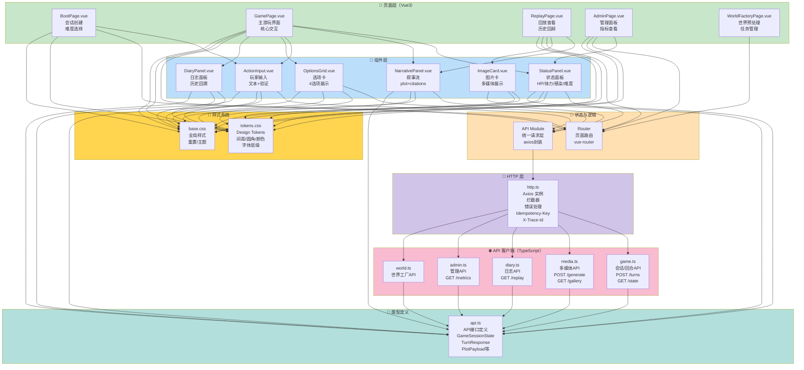

# 末日生存文字游戏平台 — 完整架构模块关系图

## 目录
1. [总体架构分层](#总体架构分层)
2. [后端模块关系](#后端模块关系)
3. [前端模块关系](#前端模块关系)
4. [前后端交互](#前后端交互)
5. [数据流向](#数据流向)
6. [模块分类与依赖](#模块分类与依赖)
7. [风险自查与扩展性](#风险自查与扩展性)

---

## 总体架构分层

```
┌─────────────────────────────────────────────────────────────────┐
│                       客户端层（Vue3）                          │
│  [启动页] [游玩页] [回放页] [管理页]  ←→  API 请求/响应        │
└─────────────────────────────────────────────────────────────────┘
                               ↓
┌─────────────────────────────────────────────────────────────────┐
│                  Spring Boot 3 REST API 层                       │
│  GameSessionController / MediaImageController / AdminController │
└─────────────────────────────────────────────────────────────────┘
                               ↓
┌─────────────────────────────────────────────────────────────────┐
│                   编排与业务逻辑层                              │
│  TurnOrchestrator → AgentChain → 责任链（8个Agent）            │
└─────────────────────────────────────────────────────────────────┘
                               ↓
┌─────────────────────────────────────────────────────────────────┐
│                   多层辅助业务层                                │
│  ┌─────────────┬────────────┬──────────┬──────────┬────────┐   │
│  │ 检索层      │ 冲突仲裁   │ 日志系统 │ 工具执行 │ 多媒体 │   │
│  │ (Retrieval) │(Arbitration)│(Diary)  │(Tools)   │(Media) │   │
│  └─────────────┴────────────┴──────────┴──────────┴────────┘   │
└─────────────────────────────────────────────────────────────────┘
                               ↓
┌─────────────────────────────────────────────────────────────────┐
│                   数据与存储层                                  │
│  Redis (会话状态/分层记忆)  ← →  PostgreSQL (持久化/向量索引)  │
└─────────────────────────────────────────────────────────────────┘
                               ↓
┌─────────────────────────────────────────────────────────────────┐
│                   外部服务与基础设施                            │
│  DashScope(文本/嵌入) / 文生图(DALL-E/本地模型) / 图片库         │
└─────────────────────────────────────────────────────────────────┘
```

---

## 后端模块关系

```mermaid
graph TB
    subgraph API["📡 API 层（HTTP 入口）"]
        A1["GameSessionController<br/>会话生命周期<br/>POST /sessions<br/>GET /state<br/>POST /turns"]
        A2["MediaImageController<br/>多媒体管理<br/>POST /generate<br/>GET /gallery-search"]
        A3["AdminMetricsController<br/>可观测系统<br/>GET /metrics/*"]
        A4["ArbitrationController<br/>冲突仲裁<br/>POST /arbitrate"]
    end

    subgraph Core["⚙️ 核心编排层（责任链）"]
        O["TurnOrchestrator<br/>单回合驱动引擎<br/>version控制"]
        AC["AgentChain<br/>责任链容器<br/>前置→后置"]
        AH["AgentHandler<br/>Agent抽象基类"]
    end

    subgraph Agents["🤖 Agent 责任链（8个）"]
        AG1["① RouterAgent<br/>路由选择"]
        AG2["② RetrievalAgent<br/>召回<br/>RAG检索"]
        AG3["③ DifficultyDirectorAgent<br/>难度控制"]
        AG4["④ PlotGenerationAgent<br/>剧情生成"]
        AG5["⑤ OptionGenerationAgent<br/>选项生成"]
        AG6["⑥ RuleGuardAgent<br/>规则校验"]
        AG7["⑦ StateCommitAgent<br/>状态提交"]
        AG8["⑧ NarrationAgent<br/>叙事补全"]
    end

    subgraph Supporting["🔧 辅助业务层"]
        RT["ReturnedAgent"]
        ARBI["ConflictArbitrator<br/>冲突仲裁<br/>多层投票"]
        DIARY["GameDiaryService<br/>游戏日志<br/>回放追踪"]
        TOOL["ToolExecutor<br/>工具调用<br/>动态执行"]
        METRIC["AgentMetricsStore<br/>性能指标<br/>Token统计"]
    end

    subgraph Domain["📦 域模型与业务"]
        GS["GameSession<br/>会话主体<br/>版本号+状态"]
        TM["TurnMemory<br/>单回合记忆<br/>L0/L1结构"]
        DIFF["Difficulty<br/>难度枚举"]
        GTF["GameTimeFlow<br/>游戏时间<br/>天/回合"]
    end

    subgraph Repository["🗄️ 数据访问层"]
        REPO1["SessionRepository<br/>会话持久化<br/>PostgreSQL"]
        REPO2["EventCardRepository<br/>事件卡库<br/>PG+向量"]
        REPO3["LorebookEntryRepository<br/>世界观库<br/>PG+向量"]
        REDIS["Redis Client<br/>会话状态缓存<br/>L0/L1分层"]
    end

    subgraph Infra["🌐 基础设施层"]
        LLM["DashScope<br/>Chat/Embedding<br/>Spring AI"]
        IMG["MediaImageService<br/>文生图/图库<br/>降级机制"]
        GUARD["FaultInjectionGuard<br/>故障注入"]
        EXCEPTION["GlobalExceptionHandler<br/>统一异常"]
        TRACE["TraceIdSupport<br/>链路追踪"]
    end

    subgraph Config["⚙️ 配置与工具"]
        WFC["WorldFactoryController<br/>离线预处理<br/>Job调度"]
        TOOL_REG["ToolRegistry<br/>工具注册表"]
        RETRY["RetryExecutor<br/>重试策略"]
        EST["LlmTokenEstimator<br/>Token估算"]
    end

    %% API → 核心编排
    A1 --> O
    A2 --> IMG
    A3 --> METRIC
    A4 --> ARBI

    %% 核心编排 → Agent链
    O --> AC --> AH
    AH --> AG1 & AG2 & AG3 & AG4 & AG5 & AG6 & AG7 & AG8

    %% Agent → 辅助业务
    AG2 --> REPO2 & REPO3
    AG6 --> ARBI
    AG7 --> REPO1
    AG4 & AG5 --> LLM
    O --> DIARY
    O --> METRIC
    AG1 --> TOOL

    %% 域模型
    O --> GS & TM & GTF & DIFF
    REPO1 --> GS
    GS --> REDIS

    %% 数据访问 → 存储
    REPO1 & REPO2 & REPO3 --> PostgreSQL[("🐘 PostgreSQL<br/>+ PGvector<br/>会话/卡/库")]
    REDIS --> Redis[("⚡ Redis<br/>JSON<br/>状态缓存")]

    %% 基础设施
    AG4 & AG5 --> LLM
    A2 --> IMG
    A1 --> TRACE
    ARBI --> EXCEPTION
    TOOL_REG --> TOOL
    EST --> AG4
    EST --> AG5

    %% 配置工具
    WFC -.->|离线预处理| REPO2
    WFC -.->|embedding生成| REPO3
    RETRY -->|通用重试| LLM
    GUARD -.->|故障演练| AG4

    style API fill:#e1f5ff
    style Core fill:#fff3e0
    style Agents fill:#f3e5f5
    style Supporting fill:#e8f5e9
    style Domain fill:#fce4ec
    style Repository fill:#f1f8e9
    style Infra fill:#ede7f6
    style Config fill:#f0f4c3
    style PostgreSQL fill:#c8e6c9
    style Redis fill:#ffe0b2
```



---

## 前端模块关系



---

## 前后端交互

```mermaid
sequenceDiagram
    actor User as 玩家
    participant FE as 前端<br/>Vue3
    participant API as REST API<br/>Spring Boot
    participant Core as 编排层<br/>TurnOrchestrator
    participant Agents as Agent链<br/>8个Agent
    participant LLM as DashScope<br/>LLM服务
    participant Store as Redis/PG<br/>存储层

    User->>FE: ① 点击提交输入或选择选项
    FE->>FE: 参数校验 + Idempotency-Key生成
    FE->>API: ② POST /turns {expectedVersion}
    activate API
    
    API->>Core: ③ 解析请求 + 版本检查
    activate Core
    
    Core->>Agents: ④ 触发责任链 (8个Agent)
    activate Agents
    
    Agents->>Store: ④a 读取EventCard/Lorebook
    activate Store
    Store-->>Agents: 检索结果
    deactivate Store
    
    Agents->>LLM: ④b 调用DashScope
    activate LLM
    LLM-->>Agents: 剧情/选项
    deactivate LLM
    
    Agents->>Store: ④c 写入状态version++
    Store-->>Agents: 确认持久化
    deactivate Store
    
    Agents-->>Core: ④ 返回OptionPayload[] + PlotPayload
    deactivate Agents
    
    Core-->>API: ⑤ 返回SubmitTurnResponse
    deactivate Core
    
    API-->>FE: ⑥ ApiResponse<SubmitTurnResponse>
    deactivate API
    
    FE->>FE: ⑦ 状态合并 + UI更新
    FE-->>User: ⑧ 显示新剧情+选项+状态面板

    Note over FE,Store: 冲突处理流程
    FE->>API: GET /state
    API-->>FE: 返回最新version
    FE->>FE: 版本对比：若冲突 → 刷新 → 显示提示
```

---

## 数据流向

### 1. 会话创建流

```
BootPage [选择难度]
    ↓
POST /api/v1/game/sessions
    ↓
GameSessionController.createSession()
    ↓
GameSessionService.initializeSession()
    ↓
[1] Redis: 存储GameSession (version=0, hp=100, ...)
[2] PostgreSQL: 插入session_history记录
    ↓
前端获得 sessionId
```

### 2. 单回合数据流

```
玩家输入 (文本 + expectedVersion)
    ↓
POST /api/v1/game/sessions/{sessionId}/turns
    ↓
GameSessionController.submitTurn()
    ├─ 校验expectedVersion (乐观锁)
    └─ TurnOrchestrator.executeTurn()
        ↓
    ┌─────────────────────────────────────────┐
    │ Agent 责任链（顺序执行或并行段）         │
    ├─────────────────────────────────────────┤
    │ ① RouterAgent                           │
    │    - 路由选择 (冒险/探索/社交/防守)     │
    │                                         │
    │ ② RetrievalAgent                        │
    │    - 多路召回 EventCard + LorebookEntry│
    │    - 向量相似度 + 标签过滤              │
    │    - 结果合并                           │
    │                                         │
    │ ③ DifficultyDirectorAgent              │
    │    - 难度指数动态调整                   │
    │    - 概率触发特殊事件                   │
    │                                         │
    │ ④ PlotGenerationAgent                   │
    │    - DashScope.chat({context})          │
    │    - 生成narrative text + citations     │
    │                                         │
    │ ⑤ OptionGenerationAgent                 │
    │    - 基于plot生成4个选项                │
    │    - 选项向量化（后续检索用）           │
    │                                         │
    │ ⑥ RuleGuardAgent                        │
    │    - 规则校验（生命值/感染度）          │
    │    - 冲突检测 → ConflictArbitrator      │
    │                                         │
    │ ⑦ StateCommitAgent                      │
    │    - 计算stateDelta (hp/stamina/infection)
    │    - Redis: version++, 原子更新        │
    │    - PostgreSQL: 审计日志               │
    │                                         │
    │ ⑧ NarrationAgent                        │
    │    - 文本补全/锚点清洁                  │
    │    - 最终交付前检查                     │
    └─────────────────────────────────────────┘
        ↓
    TurnMemory 记录 (L0: intent/loss/flags)
        ↓
    GameDiary 异步写入 (后台Job)
        ↓
    AgentMetricsStore 统计 (耗时/Token/错误)
        ↓
SubmitTurnResponse {
    plot: PlotPayload,
    options: OptionPayload[4],
    difficultyDelta: { challengeIndex: +0.05 },
    stateDelta: { staminaLoss: 5, infection: +2 },
    traceId: "tr_xxx"
}
    ↓
返回前端，前端:
    - 合并state (expectedVersion → version++)
    - 渲染新plot + options
    - 更新StatusPanel
```

### 3. 状态存储层

```
Redis (热数据 + 版本控制)
├─ game:session:{sessionId}
│  └─ GameSession JSON (version=N)
├─ game:memory:l0:{sessionId}
│  └─ TurnMemory[].intent/staminaLoss/rewardFlags
└─ game:memory:l1:{sessionId}
   └─ 核心事件向量索引

PostgreSQL (冷数据 + 向量库)
├─ sessions (会话主体)
├─ session_history (审计日志)
├─ event_cards (事件卡库) + embedding vector
├─ lorebook_entries (世界观库) + embedding vector
└─ migration/* (schema演变)
```

---

## 模块分类与依赖

### 核心模块（⭐ 直接影响玩法体验）

| 模块 | 归属层 | 核心职责 | 外部依赖 |
|------|-------|---------|---------|
| **TurnOrchestrator** | 编排层 | 单回合生命周期驱动 | Agent链/Repository/Redis |
| **Agent x8** | Agent层 | 多专家协作生成 | DashScope/Repository/Redis |
| **GameSession** | 域模型 | 会话状态机 | Redis/PG |
| **ConflictArbitrator** | 仲裁层 | 冲突解决 | 规则库/投票引擎 |
| **GameSessionController** | API层 | 会话生命周期HTTP入口 | GameSessionService |

**核心依赖关系：**
```
GameSessionController
  → GameSessionService
    → TurnOrchestrator
      → AgentChain [RetrievalAgent→DifficultyDirector→PlotGenerator→...]
        → DashScope + Repository + Redis
```

### 非核心模块（可选/辅助功能）

| 模块 | 归属层 | 职责 | 替代方案 |
|------|-------|------|---------|
| **MediaImageService** | 多媒体 | 文生图+图库降级 | 纯文本模式 / 静态图库 |
| **GameDiaryService** | 日志 | 会话回放记录 | 实时数据库 / 事件流 |
| **ToolExecutor** | 工具 | 动态工具调用 | Agent直接逻辑 |
| **AdminMetricsController** | 可观测 | 性能指标展示 | 日志聚合 / 分布式追踪 |

**非核心依赖关系：**
```
MediaImageService
  ─→ DashScope或本地模型（可降级至图库）

GameDiaryService
  ─→ 异步Job（可配置关闭）

AdminMetricsController
  ─→ AgentMetricsStore（观测用，无核心路径）
```

### 配置模块（⚙️）

| 模块 | 职责 |
|------|------|
| **WorldFactoryController** | 离线预处理编排（异步Job） |
| **FaultInjectionGuard** | 测试环境故障注入 |
| **GlobalExceptionHandler** | 统一异常处理 |
| **TraceIdSupport** | 链路追踪上下文 |

### 第三方依赖模块

| 依赖 | 类型 | 关键版本 | 用途 | 替代方案 |
|------|------|---------|------|---------|
| **Spring Boot 3.3.5** | 框架 | 3.3.5 | Web + IoC + AOP | Quarkus / Micronaut |
| **Spring AI 1.1.2** | AI框架 | 1.1.2 | ChatClient / EmbeddingModel 抽象 | LangChain / Semantic Kernel |
| **Spring AI Alibaba** | AI实现 | 1.1.2.2 | DashScope集成 | OpenAI / Claude API |
| **Spring Data JPA** | ORM | 3.3.x | PostgreSQL映射 | MyBatis / Hibernate |
| **Spring Data Redis** | 缓存 | 3.3.x | Redis连接/操作 | Lettuce / Jedis |
| **PGVector** | 向量库 | 1.1.2 | PostgreSQL向量索引 | Milvus / Pinecone |
| **PostgreSQL** | 数据库 | 14+ | 关系+向量存储 | MySQL / MongoDB |
| **Redis** | 缓存 | 6.0+ | 会话状态/L0/L1 | Memcached / 内存 |
| **Flyway** | 数据库迁移 | 10.x | Schema版本管理 | Liquibase |
| **Vue3** | 前端框架 | 3.5.13 | 组件化UI | React / Svelte |
| **Axios** | HTTP客户端 | 1.8.4 | 请求封装 | Fetch API / 原生 |

---

## 风险自查与扩展性

### 🔴 高风险点

#### 1. **LLM 推理延迟与Token超预算**
- **现象**：PlotGenerationAgent 单次调用 DashScope 可能 2-5s，高峰期超时
- **自查清单**：
  - [ ] DashScope 是否配置 timeout？(建议 10s)
  - [ ] 是否实现了降级机制（如使用缓存/模板文本）？
  - [ ] Token 消耗是否超过当天额度？(需监控 AgentMetricsStore)
- **缓解方案**：
  - 离线预处理模板 + 在线轻量路由
  - 缓存相同prompt的响应
  - 异步流式返回 (WebSocket 或 Server-Sent Events)
  - 备用模型切换（Qwen/GeminiFlash）

#### 2. **状态版本冲突与并发覆盖**
- **现象**：多个客户端或重试导致 expectedVersion 不匹配，状态混乱
- **自查清单**：
  - [ ] 是否所有写操作都验证 expectedVersion？
  - [ ] Redis 原子操作是否用了 Lua 脚本或乐观锁？
  - [ ] 前端冲突重试是否有退避策略？
- **缓解方案**：
  - StateCommitAgent 使用 Redis WATCH + MULTI 或 Lua 脚本
  - 前端收到 409 CONFLICT_VERSION 时，自动 GET /state + 指数退避重试
  - 参考案例：Redis Transactions 或 Redisson 分布式锁

#### 3. **记忆库检索导致的幻觉与冲突**
- **现象**：RetrievalAgent 召回的 EventCard/Lorebook 与当前状态矛盾，Agent 生成非一致的剧情
- **自查清单**：
  - [ ] 召回是否有冲突检测层（RuleGuardAgent）？
  - [ ] 向量索引维度是否足够（PGVector 现在 1024）？
  - [ ] 是否实现了语义对齐多层投票（如 AgentVotingLayer）？
- **缓解方案**：
  - 提升 Embedding 维度（1024 → 1536）
  - 添加显式规则约束（黑名单/冲突检测）
  - 实现 ConflictArbitrator 多层投票（语义层 + 规则层 + Agent投票）

#### 4. **离线预处理与在线数据不同步**
- **现象**：WorldFactory 构建的 EventCard/Lorebook 版本陈旧，在线查询得到过期数据
- **自查清单**：
  - [ ] worldVersion 是否在 GameSession 中记录？
  - [ ] RetrievalAgent 是否过滤了错误版本的卡？
  - [ ] 更新世界观后是否触发全量重新embedding？
- **缓解方案**：
  - 在 GameSession 中冗余 worldVersion，检索时过滤
  - WorldFactory Job 完成后自动更新指标与告警
  - 定期校验卡库与在线状态一致性

#### 5. **图片生成超时与服务链路断裂**
- **现象**：DALL-E 或文生图服务超时，导致整个 turn 失败
- **自查清单**：
  - [ ] 文生图是否与主链路分离（异步）？
  - [ ] 是否实现了快速降级到本地图库？
  - [ ] 前端是否能容忍图片加载延迟？
- **缓解方案**：
  - MediaImageService 在后台异步生成，立即返回占位符
  - 配置 fallback 机制：DashScope → 本地Stable Diffusion → 图库
  - 设置严格的 timeout (2s)，超时立即回退

### 🟡 中等风险点

| 风险 | 影响范围 | 缓解方案 |
|------|---------|---------|
| **Redis 内存溢出** | 会话缓存丢失 → 状态回滚 | 设置 maxmemory-policy + 定期清理过期数据 |
| **PostgreSQL 连接池耗尽** | API 阻塞 → 超时 | 调整 spring.datasource.hikari.maximumPoolSize |
| **Agent 链中某一环失败** | 整条链中止 → 客户端错误 | 实现 Agent Fallback 或跳过机制 |
| **前端版本冲突重试过多** | 死锁或无限重试 | 指数退避 + 最大重试次数限制 |
| **日志表无限增长** | 磁盘空间耗尽 | 实现日志分片 + 归档策略 |

### 🟢 扩展性考虑

#### 横向扩展

**现状：** 单实例 Spring Boot + 集中式 Redis + PostgreSQL

**扩展方案：**
1. **API 层水平扩展**（无状态）
   - 多个 Spring Boot 实例后接 Nginx 负载均衡
   - 依赖：Redis + PostgreSQL 必须支持并发

2. **Redis 高可用**
   - 单实例 → Redis Sentinel / Cluster
   - 保证会话状态不丢失

3. **PostgreSQL 读写分离**
   - RetrievalAgent 读从库（EventCard/Lorebook）
   - StateCommitAgent 写主库（保证强一致性）

4. **异步 Job 队列**
   - WorldFactory + GameDiary 任务卸载到消息队列（Kafka/RabbitMQ）
   - 专用 Worker 处理，不阻塞主链路

#### 纵向深化

**性能优化：**
1. **批量嵌入缓存**
   - 预计算常见输入的 embedding，存入 PGVector
   - 减少 DashScope 调用

2. **多级缓存**
   - L0: 本地内存（热点Agent结果）
   - L1: Redis（跨请求会话缓存）
   - L2: PostgreSQL（冷数据）

3. **流式生成**
   - Agent 逐步生成 plot，通过 WebSocket 实时推送
   - 降低前端感知延迟

#### 功能扩展

| 扩展方向 | 依赖改动 | 复杂度 |
|---------|---------|--------|
| **多人协作** | 需加分布式锁 + 事件广播 | 高 |
| **动态难度段位** | 只需新增 Difficulty 枚举 + Agent 逻辑 | 低 |
| **语音交互** | 需 ASR/TTS 模块 + 前端适配 | 中 |
| **3D 视觉化** | 完全独立的渲染层 | 高 |
| **离线模式** | 需 SQLite + 本地 LLM | 高 |

---

## 总结表

### 关键数据流路径（按优先级）

```
🔴 P0 (核心玩法)：
  玩家输入 → GameSessionController → TurnOrchestrator → Agent链 → Redis/PG → 前端展示

🟡 P1 (关键体验)：
  图片需求 → MediaImageService → DashScope → 图库降级
  回放查询 → GameDiaryService → PostgreSQL → 前端展示
  
🟢 P2 (监控告警)：
  Agent执行 → AgentMetricsStore → 指标上报 → AdminMetricsController
  
🔵 P3 (离线预处理)：
  WorldFactory → Job调度 → embedding生成 → PGVector索引
```

### 模块成熟度评估

| 模块 | 成熟度 | 优化空间 |
|------|--------|---------|
| API层 | ⭐⭐⭐⭐ | HTTP/2推送、GraphQL |
| 编排层 | ⭐⭐⭐⭐ | 并行Agent、超时隔离 |
| Agent链 | ⭐⭐⭐ | 失败回退、动态路由 |
| 仲裁层 | ⭐⭐ | 多层投票完善、学习机制 |
| 存储层 | ⭐⭐⭐⭐ | 读写分离、备份冗余 |
| 前端 | ⭐⭐⭐ | 离线缓存、PWA改造 |

---

## 快速参考：新增功能应该改动哪些模块？

- **新增玩家属性**（如"饥饿度"）→ GameSession + Agent逻辑
- **新增事件类型** → EventCard模型 + WorldFactory
- **新增难度分级** → Difficulty枚举 + DifficultyDirectorAgent
- **新增选项生成策略** → OptionGenerationAgent 逻辑
- **新增图片风格** → MediaImageService prompt 模板
- **新增管理功能** → AdminMetricsController + 新API
- **新增Agent专家** → AgentChain 扩展 + 责任链顺序调整

